# Cloudability : O que há de novo em 2023

## Suporte ao inventário de recursos para visualizações criadas com grupos de contas - 28 de dezembro de 2023

Com essa versão, o AWS e o Azure Resource Inventory suportariam as visualizações criadas com o uso de grupos de contas no Cloudability. Agora você pode filtrar os dados do inventário de recursos com base nas visualizações criadas usando qualquer combinação de dimensões de tag, grupos de contas e filtros de fornecedores.

Observação: o Resource Inventory, em ambos os provedores de serviços, ainda não oferece suporte a visualizações baseadas em Business Dimensions. Uma página "Visualização restrita" será exibida se você alternar para uma visualização com um filtro Business Dimension.

Como esse recurso pode ajudá-lo

Anteriormente, o Resource Inventory exibia uma página de "Visualização restrita" se você alternasse para uma visualização criada usando Account Groups.

## Lógica aprimorada para Azure Compute no inventário de recursos - 28 de dezembro de 2023

Esta versão aprimora nossa lógica existente para exibir os recursos de computação do Azure em Azure Resource Inventory em Cloudability. Como resultado, você pode esperar ver uma redução no número de recursos no serviço de computação e um aumento no número de recursos nos serviços de disco gerenciado em Azure Resource Inventory.

Como esse recurso pode ajudá-lo

Anteriormente, nossa lógica para exibir recursos no serviço de computação considerava os recursos de instantâneos e isso resultava em uma contagem de recursos maior do que a esperada para seus recursos de computação Azure. Nossa nova lógica é tal que os instantâneos serão contabilizados no serviço Managed Disk (Disco gerenciado) em vez de no serviço Compute (Computação). Dessa forma, você pode esperar ver uma redução no número de recursos no serviço de computação e um aumento no número de recursos nos serviços de disco gerenciado em Azure Resource Inventory.

## GCP Extrato detalhado – 20 de dezembro de 2023

Esta versão apresenta o Faturamento Detalhado do GCP, permitindo que você obtenha informações sobre os custos no nível de recursos do GCP por meio de relatórios e painéis do Cloudability.

Como esse recurso pode ajudá-lo

GCP introduziu o faturamento detalhado em diversos serviços, o que permite visualizar dados de custo detalhados no nível do recurso, em comparação com o faturamento padrão, que costumava fornecer os dados de custo no nível do SKU.

Mais informações sobre o lançamento

Para configurar o faturamento detalhado do GCP, você precisará:

1. Selecione o item de menu “ Configurações ” no menu de navegação principal Cloudability e, em seguida, no submenu expandido, selecione “ Credenciais do fornecedor ”.
2. Na página Credenciais, selecione a guia de navegação correspondente ao GCP para iniciar o processo de adição das credenciais do GCP ao Cloudability.
3. Selecione a opção “ GCP : Detalhamento da cobrança” na lista suspensa.
4. Adicione o ID da tabela de faturamento detalhado GCP.
5. Indique o bucket do GCS da GCP.
6. Insira a data de faturamento detalhada do GCP (ano e mês de início).
7. Baixe o modelo e execute-o no console d GCP.
8. Depois de concluído, clique em Verify Credentials (Verificar credenciais ). Uma marca verde indica que o credenciamento foi bem-sucedido.

GCP Os custos por nível de recurso estarão disponíveis em Cloudability, na seção “Relatórios e painéis”, selecionando a coluna “ID do recurso”.

## AWS Credenciamento automatizado de contas vinculadas - 19 de dezembro de 2023

Com essa versão, você pode credenciar rapidamente suas contas vinculadas ao AWS. Cloudability agora utiliza as organizações do AWS, o que permite agrupar as contas vinculadas nas organizações e executar o modelo de formação de nuvem (CFT) em um nível de organização. Isso reduz o número de execuções do AWS CFT.

Antes disso, era necessário fazer o download do CFT e executá-lo individualmente em cada conta vinculada.

Como habilitar o credenciamento automatizado

1. Adicione suas contas vinculadas em  [AWS organization](https://docs.aws.amazon.com/organizations/latest/userguide/orgs_manage_org_create.html "(Abre em uma nova guia ou janela)") no console AWS.
2. Em Cloudability, ao credenciar as contas do AWS Master Payer, ative a caixa de seleção Automated credentialing of linked accounts (Credenciamento automatizado de contas vinculadas ).
3. 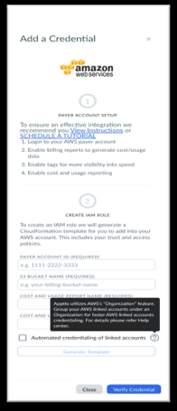
4. Gere o modelo CFT que deve ser executado no console AWS.
5. Adicione credenciais para qualquer uma das suas contas vinculadas na organização AWS, salve e faça download do modelo e execute-o para a conta vinculada selecionada no console AWS.
6. Em contas vinculadas individuais, selecione Editar > Baixar > Verificar credenciais para concluir o credenciamento das contas vinculadas.

## GCP Credenciamento automatizado de projetos do programa “ GCP ” — 19 de dezembro de 2023

Esta versão permite que você configure rapidamente as credenciais dos projetos do GCP no Cloudability.

Como esse recurso pode ajudá-lo

Cloudability Agora, o GCP permite que as organizações agrupem seus projetos GCP e executem o script shell em nível organizacional, reduzindo o número de execuções do script. Anteriormente, era necessário baixar o script de shell e executá-lo individualmente em cada projeto do GCP da sua organização.

## Apresentando o Cloudability na região da UE - 19 de dezembro de 2023

Esta versão apresenta a hospedagem de Cloudability, nossa plataforma de gerenciamento de custos em nuvem na região da UE.

Como esse recurso pode ajudá-lo

Essa versão atende às necessidades exclusivas de nossos clientes baseados na UE, garantindo que seus dados permaneçam dentro dos limites da UE. Com a localização de nossos serviços, pretendemos capacitar as organizações a reforçar seus esforços de conformidade e a se alinharem com os regulamentos relativos aos dados de gerenciamento de custos na nuvem.

Mais informações sobre o lançamento

O lançamento da hospedagem Cloudability na região da UE tem grande importância para nossos clientes que operam nessa região. Ele fornece uma solução confiável e compatível de gerenciamento de custos na nuvem que prioriza a residência dos dados, aprimora a privacidade dos dados e se alinha às normas de proteção de dados.

Nota:

Nenhuma configuração ou instalação adicional é necessária para os clientes que estão se integrando diretamente ao Cloudability na UE. O plano de migração dos clientes existentes será compartilhado no início do próximo ano.

## Indicando AWS Region para AWS Service Control Policy - 19 de dezembro de 2023

Como usuário do AWS, esta versão permite que você indique a região da política de controle do serviço AWS ao credenciar suas contas AWS em Cloudability. Ele permite que o Cloudability verifique as permissões na região mencionada.

Como esse recurso pode ajudá-lo

Anteriormente, estávamos verificando as permissões das contas AWS somente na região us-east-1. Se o SCP estivesse habilitado para uma região específica (diferente de us-east-1 ), você receberia um erro " Acesso negado " ao realizar uma verificação para suas contas AWS. Esta versão resolveu a situação acima e permite que o site Cloudability verifique as permissões na região mencionada.

## Suporte para AWS Account Tags e Azure Subscription Tags - 18 de dezembro de 2023

Com essa versão, os clientes agora podem recuperar suas tags de nível de conta AWS e de assinatura Azure de suas contas na nuvem para Cloudability. Esse recurso ajudará os clientes a criar dimensões de tag para melhor alocação de custos e estorno, além de rastrear seus gastos com a nuvem.

Mais informações sobre esta versão

Para facilitar a identificação das tags em nível de conta, acrescentamos os prefixos mencionados abaixo para as tags de conta em AWS e Azure, respectivamente:

Prefixo para AWS : cldy:aws:accountleveltag:

Prefixo para Azure : cldy:azure:subscriptionleveltag:

As etiquetas da conta aparecerão ao criar uma dimensão de etiqueta na tela Organizar > Etiquetas e rótulos.

Nota:

- ou os clientes existentes em AWS em Cloudability, uma nova permissão denominada Organizações: ListTagsForResource será concedida à função Cloudability Função de IAM que for adicionada em sua nuvem AWS. Essa permissão é necessária para obter tags em nível de conta das organizações AWS.
- Para novos clientes do AWS, a permissão mencionada acima será adicionada ao modelo de credenciamento do Cloudability, portanto, não é necessário fazer alterações na configuração.
- Para os clientes novos e existentes do Azure em Cloudability, não são necessárias alterações de configuração, e as tags em nível de assinatura começarão a aparecer no módulo Organize > Tags & Labels.

## Cloudability Agente de métricas de contêineres compatível com as versões OpenShift 4.13, 4.14 - 14 de dezembro de 2023

Esta versão oferece suporte oficial para a alocação de custos de contêineres nas versões OpenShift 4.13 e 4.14.

Como esse recurso pode ajudá-lo

Esse recurso permite insights detalhados sobre a utilização de recursos de contêineres e os custos associados para clusters que usam a variante ROSA operando nessas versões do OpenShift.

Agora você pode baixar e implementar facilmente nosso agente de métricas por meio do fluxo de trabalho de provisionamento padrão.

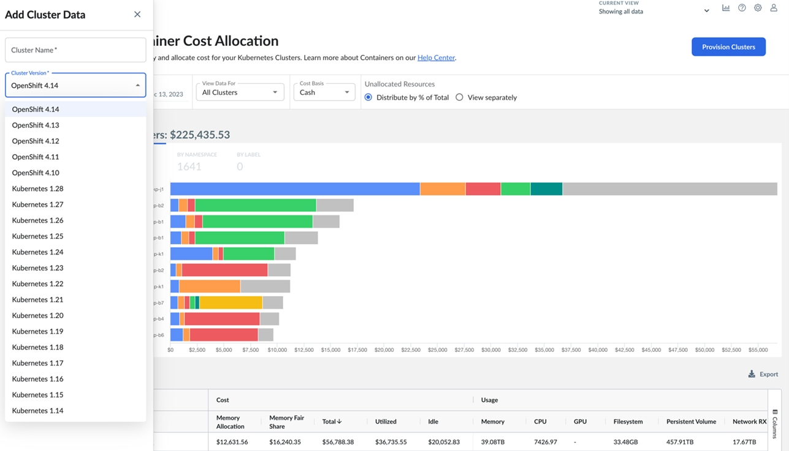

## Dimensionamento adequado do ROI - Integração do ServiceNow - 13 de dezembro de 2023

Esta versão adiciona um recurso de integração OOB ServiceNow com o recurso Rightsizing da nossa plataforma Cloudability.

Como esse recurso pode ajudá-lo

Essa funcionalidade permite gerar tíquetes de solicitações e/ou incidentes do site ServiceNow contendo recomendações de rightsizing automaticamente em sua própria instância do site ServiceNow. Esse recurso se assemelha muito à funcionalidade atual de ROI do Rightsizing que pode ser integrada ao Jira Cloud.

Com a integração dos sites Cloudability e ServiceNow,, agora você pode colaborar de forma rápida e eficiente com os recursos da nuvem e com as recomendações de dimensionamento de direitos. Esse sistema automatizado de emissão de tíquetes aumenta uma cadência de rightsizing mais eficiente para promover a otimização da nuvem por meio de processos normais de serviço. Você também terá acesso mais fácil aos registros dos detalhes das recomendações no site Cloudability, bem como na plataforma ServiceNow, juntamente com as ações (se houver) tomadas em relação às recomendações. Agora você pode calcular e exibir automaticamente a economia realizada com as ações resultantes por meio da página Rightsizing ROI em Cloudability.

Mais informações sobre o lançamento

Você pode começar inserindo suas credenciais de fornecedor do ServiceNow acessando o menu de navegação principal do Cloudability e navegando até Configurações > Credenciais de fornecedor > ServiceNow. Em seguida, você pode configurar uma política de ROI de rightsizing navegando até Configurações > Políticas de rightsizing e definindo uma política para começar a capturar automaticamente recomendações de rightsizing com base nos critérios que você definiu. Esse critério de política de ROI é usado para determinar quais recomendações de dimensionamento de direitos terão tickets criados automaticamente em sua instância ServiceNow.

Como alternativa, as recomendações de dimensionamento de direitos podem ser capturadas manualmente, navegando até a página Rightsizing em Optimize > Rightsizing e criando manualmente uma solicitação (ou incidente) ServiceNow para uma recomendação individual no menu à direita da tabela de recomendações. Para visualizar as recomendações capturadas do Rightsizing em Cloudability, navegue até Optimize > Rightsizing ROI.

## Cloudability Rightsizing - Opções de filtragem no nível da página - 12 de dezembro de 2023

Esta versão adiciona duas novas opções de filtragem em nível de página nas páginas de Rightsizing aplicáveis, fornecendo novos métodos de filtragem de recomendações com base em 1) arquitetura de CPU de computação e 2) número de recursos em um grupo de computação.

Como esse recurso pode ajudá-lo

Essa funcionalidade é a primeira etapa para fornecer opções de filtragem de Rightsizing no nível da página que filtram tanto as principais recomendações quanto as opções de recomendação adicionais fornecidas no painel de detalhes. Há duas novas opções como parte dessa versão:

1. A opção " Top Multi-Architecture ", disponível nas páginas de redimensionamento de computação. Essa opção filtra as opções de recomendação do painel de detalhes mostrando pelo menos uma recomendação de dimensionamento para cada arquitetura de CPU - Se houver economia de custos disponível para a arquitetura de CPU. As recomendações no painel de detalhes ainda são exibidas na ordem de maior economia de custos.
2. A opção " Count Reduction Only " disponível nas páginas Compute Group Rightsizing (atualmente ASG, MIG). Essa opção filtra todas as recomendações mostrando apenas aquelas que reduzem o número de instâncias no grupo.

Mais informações sobre o lançamento

Essa versão oferece mais opções para filtrar as recomendações de dimensionamento de direitos, a fim de atender aos seus casos de uso e melhorar a usabilidade. Além disso, ter opções de filtragem no nível da página que podem filtrar tanto as principais recomendações fornecidas na página quanto as opções de recomendação adicionais fornecidas no painel de detalhes permite possibilidades de filtragem mais abrangentes quando você precisar desse nível de granularidade para tomar as medidas adequadas de economia de custos.

No menu de navegação principal do site Cloudability, no item de menu Optimize (Otimizar ), selecione a opção Rightsizing (Redimensionamento ). A opção " Top Multi-Architecture " está disponível na página Compute Rightsizing (Dimensionamento da computação) de cada fornecedor (por exemplo, a página de dimensionamento da computação de AWS é EC2 ). A opção " Somente redução de contagem " está disponível na página Dimensionamento correto do grupo de computação para cada fornecedor (por exemplo, a página de dimensionamento correto do grupo de computação da AWS é EC2 ASG). Ambas as opções estarão localizadas perto da parte superior de suas respectivas páginas, ao lado dos "Filtros" atuais que já são fornecidos.

Nota:

A opção " Melhor Multi-Arquitetura " exigirá que a configuração " Permitir recomendações entre arquiteturas " seja habilitada globalmente na página Preferências de Redimensionamento localizada no item de menu Configurações como um pré-requisito. As alterações nessas preferências globais podem levar até 24 horas para entrar em vigor.

## Cloudability Recomendações de tipos de instâncias mistas no dimensionamento de direitos para AWS ASGs - 7 de dezembro de 2023

Esta versão traz novas recomendações de ajuste de capacidade do Cloudability para grupos de Auto Scaling (ASGs) do AWS EC2 com tipos de instância mistos.

Como esse recurso pode ajudá-lo

Cloudability O Rightsizing agora oferece recomendações para ASGs do tipo “ AWS EC2 ” com instâncias mistas. As recomendações de redimensionamento estavam disponíveis anteriormente apenas para ASGs do tipo instância única. Assim como as recomendações de ASG do tipo instância única, essas novas recomendações oferecem ações de economia de custos a serem implementadas no próprio grupo, que serão aplicadas automaticamente aos recursos criados por esse grupo.

Mais informações sobre o lançamento

Com o suporte adicional a recomendações de ajuste de tamanho para ASGs com tipos de instâncias mistos, você agora terá acesso a recomendações adicionais para Grupos de “ AWS Auto Scaling ” (), visando oportunidades de redução de custos por meio da identificação de recursos cujo tamanho pode ser ajustado para melhor se adequar às cargas de trabalho subjacentes.

## Cloudability Aprimoramento: Atualização do mapeamento de nomes de serviços para AWS Elastic Container Registry - 22 de novembro de 2023

Esta versão corrige um bug para garantir que o AWS Elastic Container Registry seja mapeado corretamente para o nome de serviço apropriado. Com essa atualização, o AWS Elastic Container Registry agora será mapeado com precisão para AWS ECR. Essa alteração entra em vigor hoje.

Se precisar que essa atualização seja aplicada aos seus dados históricos, entre em contato com nossa equipe de suporte ou com o representante da sua conta para solicitar um reprocessamento.

## A alocação de custos de contêineres agora é compatível com Kubernetes 1.28 Versões - 21 de novembro de 2023

Esta versão anuncia o suporte à alocação de custos de contêineres para a versão Kubernetes 1.28 em todos os provedores. Esse recurso permite que os clientes obtenham informações detalhadas sobre o uso de recursos de contêineres e os custos associados para clusters executados em Kubernetes 1.28.

Os clientes agora podem fazer o download e implementar facilmente nosso agente de métricas por meio do fluxo de trabalho de provisionamento padrão.

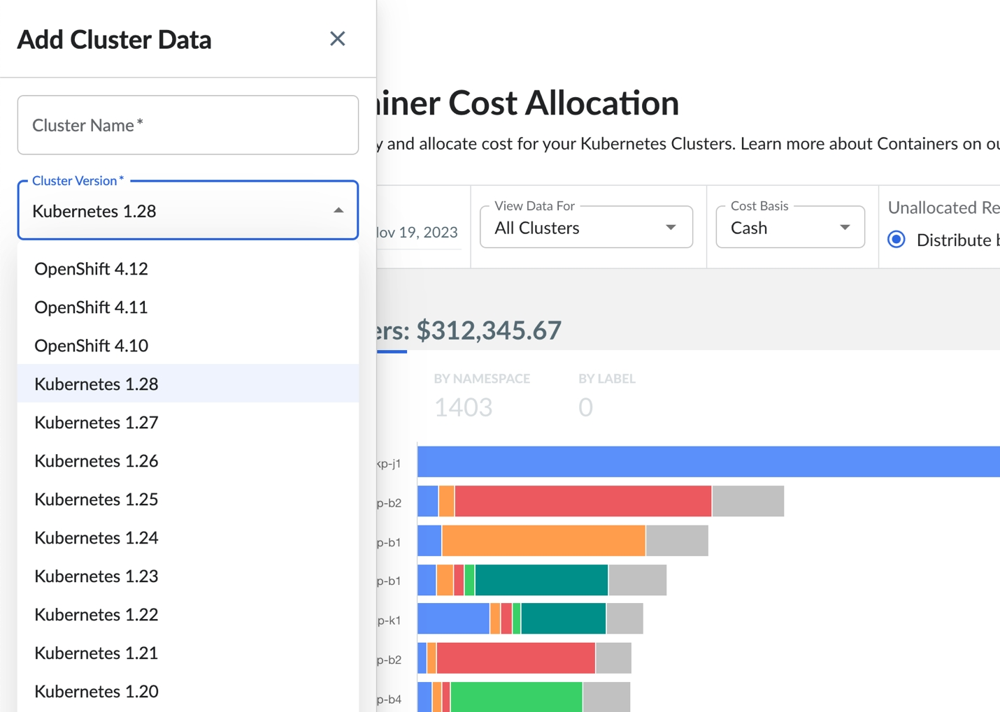

## Oracle Mecanismo de contêineres para Kubernetes : Gerenciamento e otimização de custos - 20 de novembro de 2023

Esta versão apresenta o suporte oficial do Cloudability para o Oracle Container Engine for Kubernetes (OKE). Essa versão atinge a paridade de recursos para o OCI, permitindo que os usuários alocem custos de forma granular por Namespaces e Labels, facilitando o rastreamento preciso dos custos para que eles possam ser cobrados de volta aos negócios.

Agora, os usuários podem mapear e gerenciar de forma integrada todos os seus clusters do Kubernetes ( K8s ) no OCI, AWS, Azure e GCP, já que estamos ampliando o suporte ao OKE.

Os principais destaques dessa versão incluem:

- Alocação de custos de contêineres: Explore e visualize os custos de todos os clusters OKE, categorizados por Namespaces e Labels.
- Relatórios aprimorados: As dimensões Cluster Name, Namespace e Label estão disponíveis nos relatórios principais, incluindo relatórios, painéis e o TrueCost Explorer.
- Mapeamento e visualizações de negócios: Aloque e categorize os custos em contêineres em conjunto com os custos regulares da nuvem.
- Recomendações de redimensionamento: Otimize a utilização de recursos e a eficiência de custos ao receber recomendações para alinhar os valores de solicitação e limite com os requisitos reais de carga de trabalho, reduzindo o desperdício e as despesas.

Nota:

Para instâncias de GPU, o principal fator de custo é a GPU, e a OCI não fornece nenhum custo por CPU e memória. Portanto, estamos alocando custos de contêiner no nível da GPU para clusters de GPU, mas não há alocação de custo para CPU e memória.

## Gerenciamento e otimização de custos para Oracle Kubernetes Engine - November 20, 2023

Esta versão apresenta o suporte oficial do Cloudability para o Oracle Kubernetes Engine (OKE). Essa versão atinge a paridade de recursos para o OCI, permitindo que os usuários alocem custos de forma granular por Namespaces e Labels, facilitando o rastreamento preciso dos custos para que eles possam ser cobrados de volta aos negócios.

Agora, os usuários podem mapear e gerenciar de forma integrada todos os seus clusters do Kubernetes ( K8s ) no OCI, AWS, Azure e GCP, já que estamos ampliando o suporte ao OKE.

Os principais destaques dessa versão incluem:

- Alocação de custos de contêineres: Explore e visualize os custos de todos os clusters OKE, categorizados por Namespaces e Labels.
- Relatórios aprimorados: As dimensões Cluster Name, Namespace e Label estão disponíveis nos relatórios principais, incluindo relatórios, painéis e o TrueCost Explorer.
- Mapeamento e visualizações de negócios: Aloque e categorize os custos em contêineres em conjunto com os custos regulares da nuvem.
- Recomendações de redimensionamento: Otimize a utilização de recursos e a eficiência de custos ao receber recomendações para alinhar os valores de solicitação e limite com os requisitos reais de carga de trabalho, reduzindo o desperdício e as despesas.

Nota:

Para instâncias de GPU, o principal fator de custo é a GPU, e a OCI não fornece nenhum custo por CPU e memória. Portanto, estamos alocando custos de contêiner no nível da GPU para clusters de GPU, mas não há alocação de custo para CPU e memória.

## Recomendações de redimensionamento para máquinas virtuais da OCI - 20 de novembro de 2023

Esta versão oferece suporte ao Cloudability Rightsizing para máquinas virtuais (VMs) Oracle. Esse novo recurso chama a atenção para recursos ociosos e com excesso de provisionamento para oferecer oportunidades de economia de custos, identificando recursos da OCI que podem ser redimensionados para corresponder melhor às cargas de trabalho subjacentes dos clientes e permitindo que eles acompanhem as ações no Rightsizing ROI.

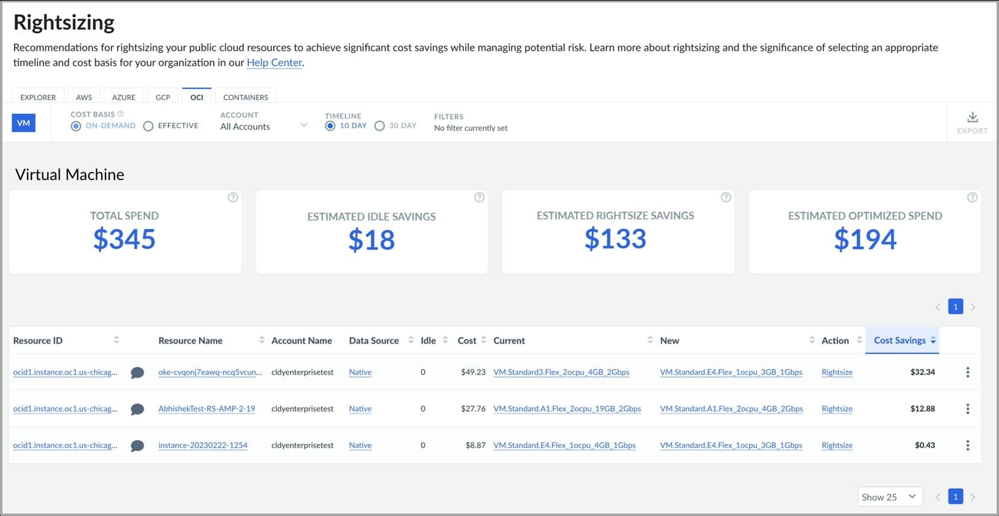

Como esse recurso pode ajudá-lo

- Recebimento de recomendações práticas para vários tipos de máquinas virtuais: Legado, flex, burstable, bare metal e pools de instâncias.
- Recebimento de análises detalhadas de economia de custos, levando em conta CPU, rede e memória para prazos de 10 e 30 dias.
- Visualização das possíveis economias no uso de nuvem do OCI, AWS, Azure e GCP no Rightsizing Explorer.

Mais informações sobre o lançamento

Para receber essas recomendações, você precisa passar pelo processo de credenciamento avançado para os contratos de locação de crianças, para que o site Cloudability possa obter os dados de utilização necessários para o rightsizing. Depois que as credenciais avançadas são verificadas, pode levar até 48 horas para que as recomendações apareçam em Cloudability. As recomendações serão exibidas na página Rightsizing (Redimensionamento ) na nova guia de fornecedor " OCI ".

## Azure Relatório de inventário de recursos - 15 de novembro de 2023

Esta versão apresenta o recurso Azure Resource Inventory para Cloudability, permitindo que você produza uma lista autorizada dos recursos de nuvem existentes Azure faturados durante um período de relatório específico.

Como esse recurso pode ajudá-lo

Como usuário do site Azure, você tem a flexibilidade de criar essa lista a partir de recursos que abrangem várias contas e escolher entre diferentes medidas (dimensões e métricas) para exibir os detalhes relevantes para elas. Essas informações disponíveis para cada recurso de nuvem unificam o faturamento, a utilização e os metadados descritivos para fornecer a você uma visão mais abrangente do inventário.

Azure O recurso de relatório Resource Inventory deve estar explicitamente ativado para sua organização Cloudability. Você deve entrar em contato com o seu TAM/CSM/ponto de contato da conta em Apptio para fazer isso. Por padrão, somente as funções Admin ou Cloudability Admin poderão acessar esse recurso. No entanto, o acesso ao inventário também pode ser concedido a qualquer função personalizada, atribuindo-lhe AWSResourceInventoryFullAccess permissões.

Observação: embora o nome dessa permissão diga " AWS ", ela também se aplica ao Azure Resource Inventory. No futuro, renomearemos a permissão para evitar confusões.

Mais informações sobre o lançamento

Você pode visualizar os dados de inventário acumulados no mês para cada serviço. Ao ativar esse recurso, os dados do inventário de recursos serão preenchidos novamente até o início do mês atual. Com o passar do tempo, os dados de inventário estarão disponíveis em uma janela contínua de três meses. Ou seja, a qualquer momento, você poderá acessar os dados de inventário de recursos do mês atual e dos dois meses anteriores. Você tem a opção de exportar os relatórios no formato “ CSV ”. Essas exportações incluem todas as colunas compatíveis com o serviço específico (ou seja, não há limite de 20 colunas).

## Reprocessamento de dados por autoatendimento (Beta) - 15 de novembro de 2023

Esta versão fornecerá um recurso de reprocessamento de dados de autoatendimento para os clientes do Cloudability e do Costing & Planning, que permitirá reprocessar seus dados sem depender das equipes de suporte ou de sucesso do cliente. Em comparação com o trabalho de reprocessamento existente, esse recurso oferece um tempo mais rápido para a resolução, elimina etapas manuais, cria transparência nas solicitações do usuário e melhora a experiência do usuário.

Como esse recurso pode ajudá-lo

Normalmente, quando você modifica sua estratégia de negócios, é necessário ajustar os mapeamentos de negócios, os grupos de contas e as tags e rótulos em Cloudability com uma atualização retrospectiva dos dados históricos. É nesse ponto que um reprocessamento de dados entra em cena. Se você for um cliente do site Cloudability, talvez só precise de reprocessamento no site Cloudability. No entanto, se também usar o Costing & Planning, suas ações também envolverão a exportação de dados para o Costing & Planning.

O trabalho de reprocessamento diário existente se concentra principalmente no reprocessamento dos dados do mês atual. Para reprocessar os dados históricos, o processo atual exige que você abra um tíquete de suporte. Esse processo manual depende do suporte e consome muito tempo, e é algo que estamos tentando eliminar com esta versão.

Nota:

O recurso não está ativado por padrão, pois precisa ser ativado explicitamente antes que você possa visualizá-lo no Cloudability. Entre em contato com seu TAM/CSM para que isso seja ativado.

Mais informações sobre o lançamento

O recurso pode ser acessado navegando para Organizar > Reprocessamento de dados em Cloudability ou Cloud Data Ingestion (CDI).

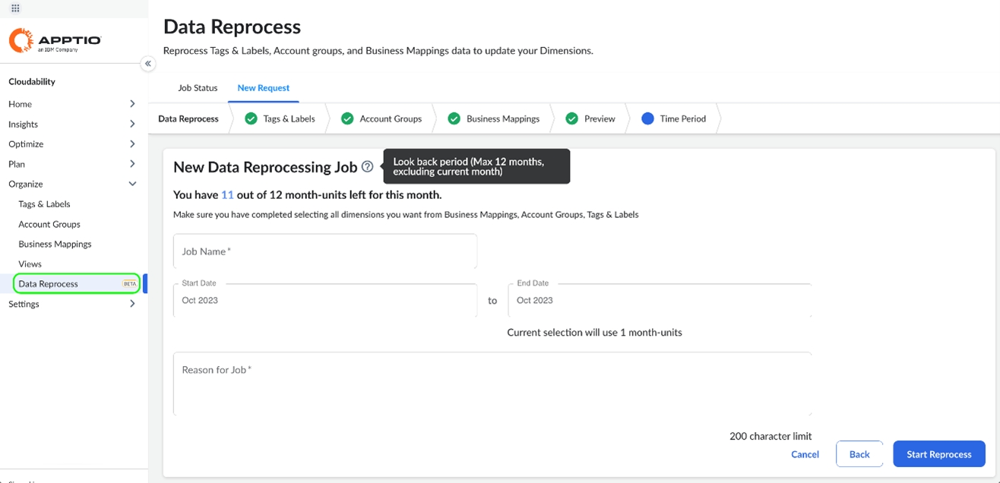

O recurso tem dois fluxos de trabalho diferentes para duas personas de usuário diferentes: Cloudability Only Data Reprocess e Cloudability - Costing & Planning Data Reprocess.

O recurso tem as seguintes limitações em termos do número de solicitações que podem ser enviadas em um mês.

- Somente os usuários do site Cloudability com a função "Admin" e os usuários do Cloud Data Ingestion (CDI) com a função "Cloud Data Ingestion" poderão acessar o recurso.
- Os clientes terão um número predefinido de unidades mensais/mês.
- Os clientes terão um período de análise predefinido de 12 meses.
- Duas solicitações de reprocessamento não podem ser enviadas ao mesmo tempo, se tiverem períodos sobrepostos.

Se você usar apenas Cloudability : Esse é um processo de duas etapas em que você pode selecionar o Período e enviar o trabalho. Você também pode monitorar o status do trabalho na guia Status do trabalho. Para obter etapas detalhadas, consulte [Reprocessamento de dados para usuários do site Cloudability](../product/data_reprocess.html).

## Relatórios prontos para uso no site Apptio BI para Cloudability TotalCost - 9 de novembro de 2023

Essa versão inclui três novos relatórios Apptio BI prontos para uso para os clientes do Cloudability TotalCost.

Novo Apptio BI Relatórios

Esta versão inclui os seguintes novos relatórios prontos para uso no site Apptio BI. Esses relatórios aproveitam os dados da fonte de dados Cloudability TotalCost. Você pode encontrar esses relatórios na página Relatórios.

Visibilidade de custos

| Descrição | Este relatório do Apptio BI oferece visibilidade dos dados de gastos em suas principais fontes de dados na nuvem, especificamente AWS, Azure, GCP e OCI, quando aplicável. |
| --- | --- |
| Casos de uso | Este relatório resolve os seguintes casos de uso: Entenda o custo total dos principais serviços de nuvem em sua organização.  Informações específicas sobre os gastos com serviços de nuvem em todos os principais provedores de nuvem. |
| Personas | Este relatório destina-se principalmente ao uso pelos profissionais do Centro de Excelência em Nuvem e do site FinOps, bem como pelos engenheiros que desejam ter visibilidade total dos gastos de suas organizações. |
| Perguntas respondidas | O relatório responde às seguintes perguntas: Qual é o valor gasto com o AWS, o Azure, o GCP e o OCI, quando aplicável?  Quanto estou gastando com os principais serviços (por exemplo: AWS S3 ) oferecidos pelos provedores de nuvem? |

TotalCost Despesas - Visualização da fatura

| Descrição | Esse relatório Apptio BI oferece visibilidade dos custos de nuvem da fatura antes de serem alocados aos consumidores. Esse relatório mostrará quais gastos são diretos, compartilhados e como está a tendência do seu orçamento em todos os provedores de nuvem. |
| --- | --- |
| Casos de uso | Este relatório resolve os seguintes casos de uso:  Entenda seus gastos com a nuvem antes que eles sejam alocados em sua organização para as entidades consumidoras.  Analise as despesas por custos diretos e compartilhados.  Acompanhe a variação orçamentária de seus gastos com a nuvem. |
| Personas | Este relatório destina-se principalmente ao uso pelos profissionais do Centro de Excelência em Nuvem e do site FinOps, bem como pelos engenheiros que desejam ter visibilidade total dos gastos de suas organizações. |
| Perguntas respondidas | O relatório responde às seguintes perguntas:  Quanto estou gastando mensalmente com meus fornecedores de nuvem?  Como estou acompanhando em relação ao planejado os meus gastos com a nuvem? Qual é a variação do meu orçamento?  Quanto dos meus gastos são custos diretos ou compartilhados? |

TotalCost Despesas - visão do consumidor

| Descrição | Este relatório Apptio BI fornece visibilidade de como os dados da nuvem foram alocados em sua organização para entidades consumidoras (por exemplo: unidades de negócios, produtos, etc.). |
| --- | --- |
| Casos de uso | Este relatório resolve os seguintes casos de uso:  Visualize seus custos compartilhados entre produtos, serviços e fornecedores.  Entenda as despesas imateriais que foram capturadas e categorizadas pelo site Cloudability TotalCost. |
| Personas | Este relatório destina-se principalmente ao uso pelos profissionais do Centro de Excelência em Nuvem e do site FinOps, bem como pelos engenheiros que desejam ter visibilidade total dos gastos de suas organizações. |
| Perguntas respondidas | O relatório responde às seguintes perguntas:  Quais são os cinco principais serviços que consomem mais gastos?  Qual foi a tendência do meu custo por fornecedor no último ano?  Quais são os principais impulsionadores dos custos compartilhados? |

## Suporte para mais regiões do Datadog - 20 de outubro de 2023

Esta versão traz suporte a mais regiões do Datadog no Cloudability. Isso ampliaria os benefícios da integração de ambos os produtos para todos os clientes do Cloudability que tenham o Datadog implantado em regiões fora das atualmente suportadas.

Suporte a novas regiões

A seguir estão as regiões do serviço “ Datadog ” que passaram a ser suportadas:

- ap1.datadoghq.com
- us3.datadoghq.com
- us5.datadoghq.com

O suporte às regiões existentes do Datadog permanece inalterado, e os usuários do Cloudability que as utilizam não precisam realizar nenhuma atualização por conta própria.

- datadoghq.com
- datadoghq.eu

O processo de credenciamento de Datadog em Cloudability continua o mesmo, sendo que a única novidade são as novas regiões que você pode selecionar na lista suspensa. Para obter mais informações sobre como conectar o Datadog no Cloudability, consulte [Conectar o Datadog ao Cloudability](../admin/connect-datadog.html).

## Cloudability Suporte ao portfólio de reservas e ao RI Planner para Azure Cache for Redis e Synapse Analytics - 19 de outubro de 2023

Com este lançamento, o Cloudability dá continuidade aos recentes lançamentos dos Planos de Economia do Azure, do Cosmos DB e do suporte ao Databricks, passando a incluir agora o Azure Cache para o Redis e o Synapse Analytics.

Como esse recurso pode ajudá-lo

Azure Os clientes do Cache for Redis e do Synapse Analytics que otimizam suas despesas por meio de reservas ( Redis e Synapse Analytics) e planos de pré-compra (Synapse Analytics) agora podem visualizar e gerenciar suas reservas no Reservation Portfolio. Cloudability expande os serviços que o portfólio de reservas suporta na nuvem Azure em resposta ao crescente número de clientes que utilizam Azure. Ao integrar o Azure Redis e o Synapse Analytics, o Cloudability oferece a esses clientes benefícios adicionais no que diz respeito à valorização das reservas de compras na nuvem Azure.

Mais informações sobre o lançamento

As reservas para o Cache do Azure para o Redis e o Synapse Analytics, dedicadas a pools de SQL, funcionam de maneira semelhante às reservas do Azure Compute, SQL e Cosmos DB. Eles são mantidos regularmente e são cobrados por hora.

Os planos de pré-compra do Azure Synapse Analytics funcionam de forma semelhante ao Databricks. Essas reservas são créditos intercambiáveis que podem ser usados durante toda a duração da reserva. Ao contrário da maioria das reservas, elas não são mantidas regularmente. Nossos KPIs e cabeçalhos de tabela foram ajustados para refletir adequadamente as informações sobre os créditos do plano de pré-compra e as SCUs. De forma semelhante ao Databricks, adicionamos um terceiro gráfico ao painel de detalhes para ajudar a entender o esgotamento de um determinado compromisso.

Nota:

O suporte para o Planejador de Instância Reservada para planos de pré-compra do Azure Synapse Analytics não está disponível no momento.

Nota:

Se ainda não tiver sido concluído, você precisa garantir que as credenciais e permissões necessárias do Azure tenham sido ativadas para fornecer ao Cloudability acesso aos seus dados.

Observação: Clientes do EA: Regenerem e executem novamente o script no nível do EA, seguindo as instruções [aqui](../admin/azure-cm-ea.html#azure-cm-ea__Configur)

Clientes do MCA: configurem o leitor da conta de cobrança por função, seguindo as instruções [aqui](../admin/azure-cm-ea.html#azure-cm-ea__grant).

## Aprimoramentos nos relatórios de utilização para o AWS EBS e a GPU – 18 de outubro de 2023

Esta versão apresenta várias novas métricas para relatórios de utilização no AWS EBS e para GPUs no Cloudability.

Essas métricas recém-introduzidas são as seguintes:

- Burst Balance (Equilíbrio de rajada) - Fornece informações sobre a porcentagem de créditos de E/S (para gp2 ) ou de throughput (para st1 e sc1 ) restantes no intervalo de rajada. Usado somente com volumes de SSD de uso geral ( gp2 ), HDD otimizado para taxa de transferência ( st1 ) e HDD frio ( sc1 ).
- Volume Consumed Read Write Ops (Operações de leitura e gravação consumidas) - A quantidade total de operações de leitura e gravação (normalizadas para 256K unidades de capacidade) consumidas em um período de tempo específico. Usado somente com volumes SSD de IOPS provisionados.
- Porcentagem de rendimento do volume - A porcentagem de operações de E/S por segundo (IOPS) fornecidas do total de IOPS provisionado para um volume do Amazon EBS. Usado somente com volumes SSD de IOPS provisionados.

  Essa métrica não é compatível com volumes habilitados para vários anexos
- Utilização da GPU - Porcentagem de tempo em um período de amostra em que um ou mais kernels na GPU estavam em execução.
- Utilização de memória da GPU - Porcentagem de tempo em um período de amostra em que a memória estava sendo gravada ou lida.

  Para obter bons resultados com as métricas de GPU, certifique-se de ter configurado [as métricas mínimas de GPU](https://docs.aws.amazon.com/dlami/latest/devguide/tutorial-gpu-monitoring-gpumon.html "(Abre em uma nova guia ou janela)") como pré-requisito.

Como esse recurso pode ajudá-lo

Esta versão aprimora o suporte às métricas de utilização do AWS no Cloudability e permite que os clientes obtenham informações detalhadas sobre as métricas de utilização do AWS EBS e da GPU.

## Suporte à integração do Turbonomic com o Cloudability - 17 de outubro de 2023

Esta versão apresenta a integração do Turbonomic com o Cloudability, possibilitando funcionalidades adicionais de otimização na nuvem e o acesso a dados da sua conta Turbonomic no Cloudability para ambos os produtos.

Como esse recurso pode ajudá-lo

Para os clientes atuais (e futuros) dos sites Cloudability e Turbonomic, há funcionalidades e dados relacionados à otimização que estão presentes em um dos produtos, mas não no outro. Anteriormente, não havia integração pronta para uso entre o Cloudability e o Turbonomic e, portanto, os clientes de ambos os produtos precisavam acessar cada um deles separadamente para utilizar as funcionalidades contidas em cada um. Esse recurso dará início ao processo de aprimoramento do site Cloudability, permitindo que os clientes de ambos os produtos tenham acesso a funcionalidades adicionais do Turbonomic e que os dados sejam exibidos diretamente no próprio site Cloudability.

Mais informações sobre o lançamento

Para configurar as credenciais d Turbonomic, selecione o item de menu “ Configurações ” no menu de navegação principal do Cloudability e, em seguida, no submenu expandido, selecione “ Credenciais de fornecedores ”. Na página “Credenciais”, selecione a guia de navegação “ Turbonomic ” para iniciar o processo de vinculação das credenciais da conta Turbonomic ao Cloudability. Depois que a integração do Cloudability / Turbonomic estiver configurada, acesse a nova página Turbonomic selecionando o item de menu “Optimize ” no menu de navegação principal do Cloudability e, em seguida, no submenu expandido, selecione “ Turbonomic ”. As novas funcionalidades e dados serão exibidos a partir dos gráficos em nuvem “Investimentos Necessários” e “Economias Potenciais”, juntamente com os valores correspondentes, disponíveis em Turbonomic.

## Expansão do suporte à métrica Cloudability Cost (List) para todos os serviços Azure - 13 de outubro de 2023

Esta versão introduz um aprimoramento significativo no site Cloudability com uma métrica de custo mais abrangente e consistente para despesas com a nuvem.

Nossa métrica "Cost (List)" agora está expandindo seu suporte para abranger todos os serviços Azure, além do suporte existente para Azure Compute e Azure Database.

Como esse recurso pode ajudá-lo

"Cost (List)" é uma métrica de custo do site Cloudability que fornece uma visão consistente e "não adulterada" dos custos da nuvem, excluindo os benefícios de reservas, instâncias Spot e preços personalizados. Em um cenário de nuvem em que vários tipos de descontos e compromissos influenciam continuamente as taxas pagas pelo uso da nuvem, ter uma métrica de custo "não adulterada" é inestimável. Isso permite que você influencie descontos ou cobertura de compromisso para obter consistência no preço da nuvem. Isso não apenas ajuda no planejamento financeiro, mas também é eficaz para medir o impacto de suas iniciativas de eficiência.

Mais informações sobre o lançamento

Para esta versão, as alterações se concentram em fornecer insights prospectivos. Se estiver interessado em acessar dados históricos, entre em contato com a equipe da sua conta ou com o TAM para que seja feito um backfill.

## Suporte para a métrica de custo (amortizado ajustado) em Cloudability AWS Resource Inventory - 4 de outubro de 2023

Esta versão introduz o suporte para a métrica Custo (Amortizado Ajustado) no recurso AWS Resource Inventory.

Você encontrará essa métrica como uma das colunas padrão na grade do relatório AWS Resource Inventory.

## Aprimoramento da detecção de anomalias: Suporte para configurar alertas de e-mail/ PagerDuty com base no limite de porcentagem - 28 de setembro de 2023

Esta versão apresenta um novo recurso de detecção de anomalias que permite configurar alertas com base no limite de porcentagem. Esse aprimoramento complementa nosso sistema de alertas existente, que se baseia em valores absolutos, e oferece mais flexibilidade e precisão no gerenciamento de seus alertas.

Como esse recurso pode ajudá-lo

Com essa atualização, agora você pode configurar alertas para serem acionados com base em limites de porcentagem, além dos alertas de valor absoluto existentes. Isso significa que você tem a opção de configurar alertas com base em uma alteração percentual específica de uma linha de base ou em valores absolutos, dependendo das suas necessidades de monitoramento. Ambas as combinações ou qualquer uma delas (limite percentual, valor absoluto) serão compatíveis com uma exibição específica. Essa flexibilidade permite que você adapte sua estratégia de alerta para atender aos seus casos de uso e requisitos específicos.

Esteja ciente de que esse novo recurso de alerta de limite de porcentagem não é retroativo. Para aproveitar esse recurso, você precisará definir novas configurações para os limites de porcentagem, se eles forem necessários para o seu monitoramento. As configurações de alerta existentes baseadas em valores absolutos continuarão a funcionar como antes.

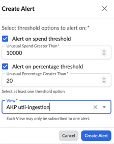

## Manuseio aprimorado da etiqueta Kubernetes no Cloudability Container Insights - 28 de setembro de 2023

Esta versão apresenta um aprimoramento para a guia de rótulo Kubernetes na página Container Insights. Esse aprimoramento refinará a apresentação dos rótulos selecionando os valores de rótulos mais relevantes, eliminando a concatenação de rótulos.

Como esse recurso pode ajudá-lo

Atualmente, quando os metadados associados ao contêiner, incluindo rótulos de namespace, rótulos de serviço, rótulos de implantação e rótulos de nó, compartilham a mesma chave de rótulo, mas apresentam valores de rótulo diferentes, esses valores são mesclados. Para melhorar isso, estamos introduzindo uma alteração em nosso pipeline. Essa alteração garantirá que apenas o valor mais relevante do rótulo seja exibido, eliminando a concatenação de rótulos.

Em cenários em que os metadados associados ao contêiner possuem chaves de rótulo com valores de rótulo conflitantes, nosso sistema priorizará o valor de rótulo mais relevante. A determinação da relevância é baseada na granularidade do recurso. Aqui está a ordem de relevância (da maior para a menor):

1. Pod
2. proprietário do pod de 1º nível (por exemplo, ReplicaSets, Daemonsets, Jobs)
3. proprietário do pod de segundo nível (por exemplo, implantações)
4. Kubernetes Service
5. Namespace:
6. Nó

Mais informações sobre o lançamento

Após o lançamento dessa alteração na produção, os usuários não encontrarão mais valores concatenados na guia Labels (Rótulos) da página Container Insights para dados recebidos após a data de lançamento. Além disso, os usuários podem notar alocações de custo mais altas para valores de etiqueta que antes eram artificialmente reduzidos devido à atribuição de custo a valores concatenados.

- Os dados históricos que contêm valores de rótulo concatenados permanecerão inalterados.
- GKE Os clusters ainda podem exibir valores de rótulo concatenados no Reporting.

Acreditamos que esse aprimoramento melhorará significativamente a clareza e a precisão da representação dos rótulos no Container Insights, oferecendo uma experiência de usuário mais simplificada e informativa. Agradecemos seu apoio contínuo enquanto trabalhamos para aprimorar nossa plataforma.

Nota:

Embora nosso objetivo seja eliminar valores de rótulos concatenados, há cenários raros em que a concatenação ainda ocorrerá. Isso inclui casos em que um pod está associado a dois ou mais serviços Kubernetes diferentes, e esses serviços têm valores de rótulo conflitantes sem nenhum outro objeto mais relevante para ter precedência.

Se tiver alguma dúvida ou precisar de mais informações, não hesite em entrar em contato com a equipe da sua conta ou com o suporte.

## Capacidade de classificação no Cloudability Resource Inventory - 25 de setembro de 2023

Esta versão apresenta as opções de classificação manual muito mais convenientes para o recurso Cloudability Resource Inventory lançado em julho de 2023. Naquela época, o recurso tinha apenas a opção padrão de classificação automática por Custo (Total) decrescente e, com esta versão, os usuários podem classificar seus dados de inventário com base em qualquer uma das colunas desejadas (dimensões ou métricas) exibidas na grade do relatório de inventário.

Os usuários agora podem selecionar qualquer um dos cabeçalhos de coluna exibidos na grade do relatório de inventário para classificar os dados de inventário em ordem alfabética (para colunas baseadas em texto) ou em ordem crescente/decrescente (para colunas baseadas em números). A opção é indicada pelo ícone de seta habitual, conforme mostrado abaixo:

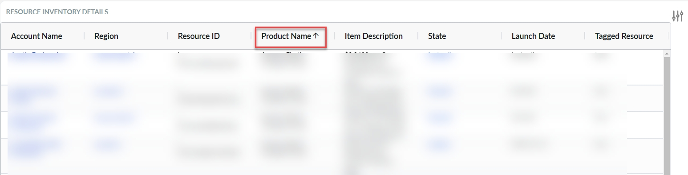

Consulte [Inventário de recursos](../product/aws-resource-inventory.html) para obter mais informações sobre o recurso original.

## Cloudability oCI - Gestão de custos - 14 de setembro de 2023

Apptio anuncia um aprimoramento significativo em sua suíte de produtos Cloudability, oferecendo aos profissionais da FinOps acesso imediato aos dados de custo e uso da infraestrutura de nuvem (OCI) da Oracle nativamente na plataforma Cloudability.

Como esse recurso pode ajudá-lo

Essa versão permite que os clientes da OCI:

- Alocar automaticamente todos os custos de OCI de volta aos negócios com base em suas regras específicas, aproveitando as dimensões de negócios do site Cloudability
- Analise seus gastos com OCI e melhore a propriedade da equipe, aproveitando a análise em nível de recurso, painéis interativos de várias nuvens e exibições personalizadas
- Promova a responsabilidade financeira configurando orçamentos da OCI e notificações de eventos

  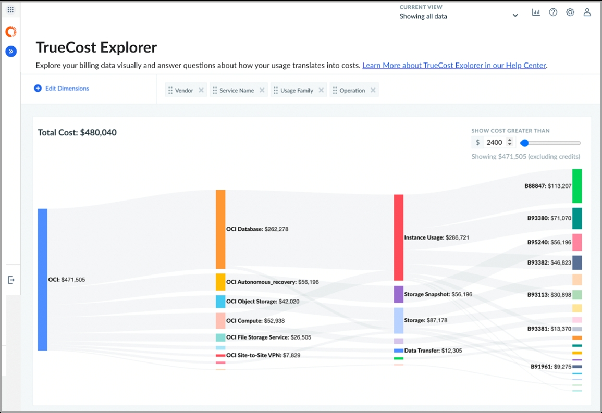

Mais informações sobre o lançamento

Se você já é cliente da OCI, pode iniciar sua jornada de gerenciamento de custos adicionando credenciais para o seu locatário seguindo as instruções do [Connect Oracle Cloud](../admin/connect-oracle-cloud.html).

Por padrão, o site Cloudability assimilará o mês atual dos dados da OCI depois que suas credenciais forem validadas. Se desejar que outros meses de dados sejam ingeridos, entre em contato com a equipe do Apptio, que terá prazer em ajudá-lo.

Para quem estiver procurando acesso programático para gerenciar suas credenciais do OCI, consulte nossa [documentação da API pública](../api-v3/getting_started_with_the_cloudability.html).

Para obter mais informações sobre como gerenciar os custos do OCI no Cloudability, participe da conversa na [Comunidade Apptio](https://community.apptio.com/blogs/soline-plichta/2023/09/14/cloudability-for-oci-cost-management-faq "(Abre em uma nova guia ou janela)").

## Cloudability Filtragem de exclusão de tipo de instância/família de computação nas preferências de redimensionamento - 30 de agosto de 2023

Esta versão oferece uma nova configuração global nas Preferências de dimensionamento de direitos que permite excluir recomendações de computação para um tipo de instância ou família de instâncias específicas com base nos valores inseridos.

Como esse recurso pode ajudá-lo

Anteriormente, o site Cloudability só fornecia filtragem de tipo de instância/família para recomendações de dimensionamento de direitos de computação no nível da página e somente para as principais recomendações fornecidas, sem nenhuma maneira de filtrar globalmente ou com base em uma recomendação individual. Esta versão oferece uma nova configuração global para você nas Preferências de dimensionamento para excluir recomendações de computação que contenham tipos/famílias de instância específicos com base nos valores de exclusão inseridos.

Mais informações sobre o lançamento

A filtragem e/ou exclusão relacionada à instância já existe localmente nas páginas de dimensionamento de direitos de computação usando os filtros Instance Family (Novo) e Instance Type (Novo). No entanto, eles filtram apenas as recomendações que têm uma recomendação principal com esses valores. Essa nova funcionalidade global Rightsizing Preferences fornece um mecanismo para excluir todas as recomendações de computação que atendam aos critérios (valores) inseridos por você, independentemente de a recomendação ser uma recomendação principal ou uma das muitas opções de recomendação contidas no painel de detalhes do rightsizing. Há limitações intencionais que são projetadas sobre quais recomendações são aplicáveis a esse mecanismo de exclusão - as recomendações de "encerrar" e "nenhuma ação" não serão vinculadas à lista de exclusão, pois uma alteração no tipo/família da instância não está sendo realmente recomendada.

No menu de navegação principal do site Cloudability, no item de menu Settings (Configurações), selecione a opção Rightsizing Preferences (Preferências de redimensionamento). Nas preferências do Compute ( VM ), há uma opção para “Excluir recomendações nas quais o tipo de instância recomendado contenha os seguintes valores”. Nessa opção, haverá caixas de texto em que você poderá inserir valores adicionais que excluirão todas as recomendações de computação em que o tipo/família de instância contenha esses valores.

## Analisar a contribuição de custo para cada tipo de recurso no Container Insights - 18 de agosto de 2023

Esta versão introduz a capacidade de rastrear os custos associados a cada tipo de recurso, como CPU e memória, no Container Insights do site Cloudability.

Como esse recurso pode ajudá-lo

Com esse lançamento de recurso, você pode visualizar insights de custo abrangentes para uma série de métricas de uso, incluindo memória, CPU, GPU, sistema de arquivos, volume persistente (PV), RX de rede e TX de rede.

Mais informações sobre o lançamento

Os principais recursos desse aprimoramento são:

- Rastreamento de custos: Entendemos a importância de gerenciar despesas, por isso integramos o controle de custos para uma variedade de métricas de uso diretamente na página Container Insights. Isso permite que você tome decisões informadas sobre alocação e otimização de recursos.
- Métricas de custo flexíveis: Esse recurso será compatível com a métrica de custo utilizado e de compartilhamento igualitário para cada uma das métricas de uso (por exemplo, custo utilizado da CPU, custo de compartilhamento igualitário da CPU), oferecendo a flexibilidade de adaptar a análise de custo às suas preferências.
- Cobertura abrangente de métricas: As métricas cobertas por esse aprimoramento incluem CPU, memória, GPU, sistema de arquivos, volume persistente (PV), RX de rede e TX de rede. Essa cobertura abrangente permite que você obtenha insights profundos sobre as implicações de custo de cada aspecto do seu ambiente em contêiner.
- Análise de custo histórico: A partir de 18 de agosto de 2023, os dados históricos de custo estarão acessíveis para todas as métricas suportadas. Isso permite que você acompanhe as tendências de custo ao longo do tempo e tome decisões bem informadas sobre a utilização de recursos.
- Suporte a pontos de extremidade públicos: Nesta versão, você também poderá acessar essas métricas enriquecidas por meio de nossos endpoints públicos, garantindo uma integração perfeita com os fluxos de trabalho existentes para a API Cloudability.

Você pode marcar/desmarcar manualmente colunas de custos adicionais, conforme abaixo.

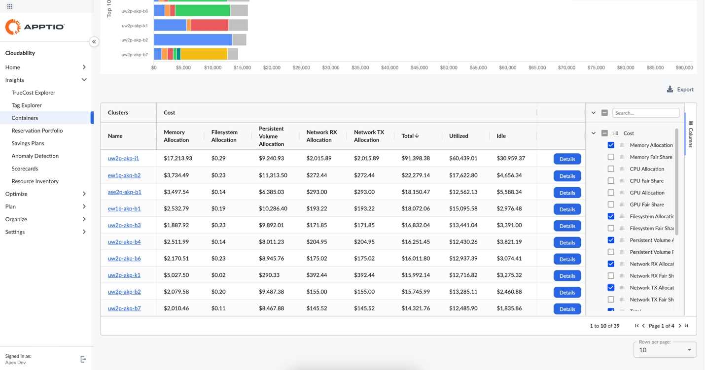

Nota:

Em caso de dúvidas ou assistência, entre em contato com a equipe da sua conta ou com o suporte.

## Comentários aprimorados para ROI de redimensionamento e redimensionamento em Cloudability - 14 de agosto de 2023

Esta versão oferece aprimoramentos adicionados à funcionalidade Rightsizing /Rightsizing ROI Comments.

Como esse recurso pode ajudá-lo

Essa funcionalidade adiciona um indicador no ícone "Comentários" quando comentários foram adicionados e existem para uma recomendação. Além disso, os comentários existentes para qualquer recomendação específica mostrada na página Rightsizing (Redimensionamento) ou na página Rightsizing ROI (ROI de redimensionamento) serão mesclados e todos os comentários feitos em qualquer uma das páginas serão exibidos em ambas as páginas.

Mais informações sobre o lançamento

Até esta versão, não havia nenhum indicador mostrado quando um comentário era feito em uma recomendação de Rightsizing. Para ver se algum comentário havia sido feito, você precisava clicar no ícone de comentários e abrir o modal de comentários. Esta versão introduz um indicador no ícone de comentários na tabela sempre que houver comentários disponíveis.

Anteriormente, todos os comentários feitos em um recurso específico eram armazenados separadamente quando feitos na página Rightsizing (Dimensionamento de direitos) e na página Rightsizing ROI (ROI de dimensionamento de direitos). Para evitar confusão, os comentários existentes para recursos específicos serão mesclados de ambas as páginas para criar um arquivo único de "Comentários". A partir de agora, sempre que um comentário for adicionado a uma das páginas, ele será exibido em ambas e fará parte de um único arquivo de comentários para esse recurso específico.

Nota:

O indicador de comentários aparecerá no ícone de comentários de um recurso em qualquer tabela de Rightsizing em que existam comentários. Isso inclui as páginas Rightsizing e Rightsizing ROI, bem como quaisquer subpáginas aplicáveis.

## Apptio BI disponível em Cloudability (BETA) - 9 de agosto de 2023

Essa versão integra o Apptio BI com todos os recursos do Cloudability, eliminando a necessidade de navegar entre vários aplicativos.

Você pode acessar todos os seus relatórios do Apptio BI, incluindo relatórios baseados em casos de uso comuns do FinOps, recursos inovadores e analisar todas as fontes de dados diretamente no Cloudability.

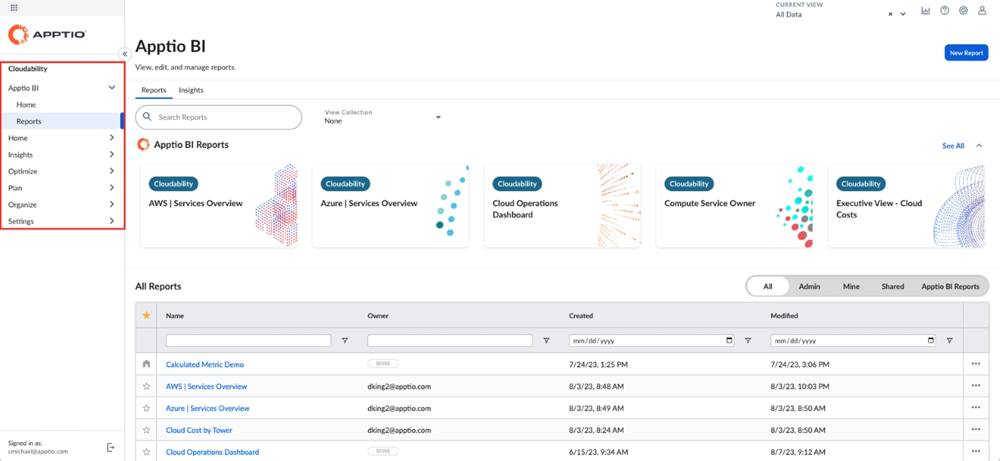

Nota:

Esta versão já está disponível para os clientes d Cloudability. Se você deseja integrar o Apptio BI ao seu aplicativo Cloudability, entre em contato com sua equipe de atendimento dedicada para obter mais assistência e orientação.

## Cloudability - Apresentando três novas dimensões do Cloudability - 4 de agosto de 2023

Nesta versão, três novas dimensões foram introduzidas para Cloudability Azure Dados de custo especificamente.

Como esse recurso pode ajudá-lo

Essas dimensões fornecem insights e granularidade aprimorados sobre seus gastos em Azure. Essas dimensões específicas do site Azure são:

1. Azure Nome do pedido de reserva : essa dimensão permite rastrear e analisar os custos associados a diferentes nomes de pedidos de reserva Azure. Ele também ajuda a obter uma compreensão mais profunda de como os vários pedidos de reserva afetam seus gastos gerais e, assim, otimizar suas reservas de acordo.
2. Número da peça : a dimensão Número da peça fornece visibilidade detalhada dos custos com base nos números de peça específicos do site Azure associados aos seus recursos. Ao usar essa dimensão, você pode alocar melhor os custos e tomar decisões informadas sobre a utilização de recursos.
3. Nome da reserva : Com a dimensão Nome da reserva, agora você pode analisar e gerenciar os custos relacionados a diferentes reservas Azure. Ele também ajuda a obter insights sobre como as reservas são utilizadas em vários recursos e, assim, tomar medidas proativas para otimizar a utilização de suas reservas.

Mais informações sobre o lançamento

Essas novas dimensões são específicas para os dados de custo do Azure e estarão disponíveis exclusivamente para os recursos do Azure. Elas fazem parte de nossos esforços contínuos para oferecer recursos de gerenciamento de custos abrangentes e focados em Azure.

## Suporte de GPU para Container Cost Insights - 31 de julho de 2023

Esta versão introduz a visibilidade do uso da GPU (Graphics Processing Unit, unidade de processamento gráfico) e os custos associados para cargas de trabalho do Kubernetes para o Cloudability Container Insights. Essa funcionalidade oferece suporte aos usuários que têm contêineres implantados em VMs com suporte de GPU, ajudando-os a maximizar os benefícios dos recursos dedicados de processamento gráfico para tarefas como aprendizado de máquina, processamento de dados, renderização e outras cargas de trabalho com uso intensivo de computação.

Como esse recurso pode ajudá-lo

Esta versão apresenta uma nova métrica "GPU" na tabela de uso da página Container Insights. Com essa adição, você pode visualizar facilmente o número de GPUs alocadas no nível do cluster, do namespace e do rótulo. Os custos alocados aos valores do namespace e do rótulo agora consideram um conjunto atualizado de ponderações que levam em conta o preço relativo das GPUs em cada nó. Como as diferentes máquinas virtuais utilizam hardware variado, o custo de uma GPU está, portanto, vinculado a cada família de VM e ao tipo específico de GPU utilizado por essa família.

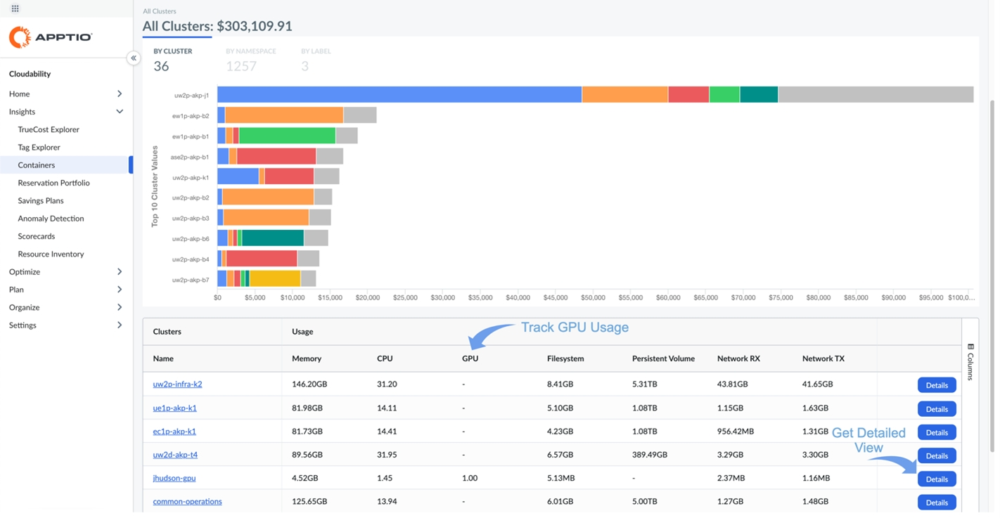

Mais informações sobre o lançamento

Para entender melhor essas mudanças, vamos ilustrar uma comparação de como os custos eram distribuídos anteriormente e como serão alocados após essa atualização.

Anteriormente, nosso modelo considerava a utilização de CPU, memória, rede e disco, o que se mostrou suficiente para VMs padrão. No entanto, nas VMs com suporte de GPU, os custos podem ser substancialmente mais altos, geralmente de duas a três vezes mais do que em VMs semelhantes sem GPUs. Sem considerar o impacto das GPUs e quem as estava usando, uma parte da história estava faltando. A tabela abaixo mostra como as ponderações foram aprimoradas para uma instância específica do EC2 apoiada por GPU com esse lançamento.

|  | CPU do nó | CPU do nó Peso | Memória do nó | Peso da memória do nó | GPUs de nó | Nó GPUs Peso |
| --- | --- | --- | --- | --- | --- | --- |
| Anterior | 8 | 25% | 40 GB | 75% | 2 | 0% |
| Atual | 8 | 12.5% | 40 GB | 37.5 | 2 | 50% |

Com as ponderações atualizadas, determinou-se que a GPU contribui com 50% do custo de VM, com a memória reduzida para 37.5 % e a CPU para 12.5 %. O exemplo a seguir mostra como isso afeta a alocação de custos para três cargas de trabalho hipotéticas que estão consumindo esse serviço de armazenamento em nuvem ( VM ).

| Planejamento da carga de trabalho | Utilização da CPU | Utilização de memória | Utilização da GPU | Alocação de custos anterior | Alocação de custos atualizada |
| --- | --- | --- | --- | --- | --- |
| A | 2 milhões de rupias | 16 GB | 1 | 36.25% | 43.125% |
| B | 2 milhões de rupias | 8 GB | 1 | 21.25% | 35.625% |
| C | 4 milhões de rupias | 16 GB | 0 | 42.5% | 21.25% |

Como fica evidente no exemplo acima, o modelo atualizado agora reflete o custo real da utilização da GPU, resultando em uma alocação de custos mais precisa e justa entre diferentes cargas de trabalho. As cargas de trabalho A e B mostram um aumento no preço, refletindo a utilização do recurso de GPU relativamente caro. Esse aprimoramento proporciona maior visibilidade dos custos dos recursos e permite um melhor gerenciamento de custos.

Nota:

Esta versão oferece suporte a cargas de trabalho com suporte de GPU em execução no AWS e no GCP. Mais especificamente, o caso de uso abordado nesta versão diz respeito a GPUs totalmente reservadas (o suporte à [implementação MIG da Nvidia](https://www.nvidia.com/en-au/technologies/multi-instance-gpu/ "(Abre em uma nova guia ou janela)") não faz parte desta versão). Estamos trabalhando ativamente para adicionar suporte completo a máquinas virtuais com suporte de GPU em execução no Azure. Atualmente, para as VMs do Azure, a métrica de uso é exibida para o consumo de GPU, mas as ponderações de custo ainda não foram atualizadas. Essa atualização é refletida a partir de 1º de agosto de 2023, sem qualquer impacto sobre o uso e o custo históricos.

## Ajuste do suporte para grupos de instâncias gerenciadas d GCP — 25 de julho de 2023

Esta versão traz recomendações de ajuste de tamanho d Cloudability para os Grupos de Instâncias Gerenciadas (MIG) do GCP GCE.

Anteriormente, as recomendações de Rightsizing eram fornecidas apenas para cada recurso individualmente, mesmo que a máquina tivesse sido gerada por um único “cluster” — como um Grupo de Instâncias Gerenciadas do GCP — e fosse utilizada exclusivamente dentro desse cluster. Nesta versão, o Rightsizing do Cloudability oferece recomendações para os MIGs do GCE do GCP. Os clientes podem realizar ações a serem implementadas no próprio grupo, que serão aplicadas automaticamente aos recursos criados por esse grupo.

Como esse recurso pode ajudá-lo

GCP Os clientes que utilizam MIGs agora podem visualizar automaticamente ações específicas recomendadas para economia no nível de configuração do grupo, em vez de apenas no nível de cada recurso individual.

A economia do grupo será potencialmente muito maior do que cada recurso dentro do grupo. Além disso, os recursos que fazem parte dos grupos de instâncias gerenciadas são configurados como um grupo, portanto, fornecer recomendações no nível do grupo e no nível da máquina virtual individual é ideal, pois esses grupos são configurados como uma entidade inteira.

Mais informações sobre o lançamento

O GCE MIG está disponível na guia “ GCP ”, na seção “Rightsizing ”. GCP Os dados do MIG e as recomendações de redimensionamento são exibidos automaticamente se o cliente utilizar os MIGs d GCP.

Essa experiência do usuário é semelhante à funcionalidade de dimensionamento de direitos existente no site Apptio para recursos individuais de GCE. A tabela principal mostra todos os grupos com despesas no período especificado. Por padrão, os grupos são classificados por economia de custos. Os clientes podem começar no topo da lista para ver os grupos com o maior potencial de economia.

Nota:

As recomendações para os recursos do MIG não serão duplicadas em vários serviços (como o GCE e o GCE MIG). Se um recurso fizer parte de um grupo de instâncias gerenciadas, ele não aparecerá mais nas recomendações padrão de ajuste de recursos do GCE ( GCP ). Ele aparecerá apenas nas recomendações de dimensionamento do MIG. Somente os recursos On-Demand serão incluídos nessas recomendações.

## Suporte à utilização da GPU para o ajuste da capacidade de computação do GCP — 25 de julho de 202

Esta versão dá continuidade ao aprimoramento correlacionado à GPU das recomendações de dimensionamento de direitos do site Cloudability, incorporando e utilizando o processamento da GPU e a utilização da memória.

Para cargas de trabalho modernas, como aprendizado de máquina, os clientes estão achando cada vez mais úteis as máquinas virtuais em nuvem, não apenas com CPUs, mas também com GPUs. Com esta versão, os clientes do GCP cujos dados são importados pelo Apptio por meio do GCP ou do Datadog também poderão incluir seus dados de GPU para receber recomendações aprimoradas de ajuste de capacidade.

Como esse recurso pode ajudá-lo

Agora, os clientes do GCP que possuem instâncias de computação com GPUs poderão receber recomendações de economia com base nas métricas de GPU coletadas pelo Apptio, bem como recomendações de tipos de instância com base nessas métricas para tipos de instância que incluam GPUs. Essas métricas oferecem uma nova dimensão ao mecanismo de recomendações do Cloudability, permitindo que nossos clientes obtenham economias adicionais. Anteriormente, os dados da GPU não eram levados em consideração ao fornecer recomendações de dimensionamento de recursos de computação d GCP.

Mais informações sobre o lançamento

No menu de navegação principal do Cloudability, selecione o item de menu “Otimizar ” > selecione “Rightsizing ”e, em seguida, selecione a guia “ GCP ”.

As recomendações de dimensionamento para instâncias do GCE com GPUs serão exibidas automaticamente se estiverem configuradas e disponíveis corretamente. Haverá pequenos acréscimos à exibição de "detalhes" da recomendação para instâncias com GPUs, pois agora haverá gráficos adicionais para a utilização da GPU (%) e da memória da GPU.

 Pré-requisitos 

1. Cada VM deve ter [GPUs conectadas](https://cloud.google.com/compute/docs/gpus/create-vm-with-gpus "(Abre em uma nova guia ou janela)").
2. Cada VM deve ter um [driver de GPU instalado](https://cloud.google.com/compute/docs/gpus/install-drivers-gpu#verify-driver-install "(Abre em uma nova guia ou janela)").
3. Cada VM deve ter o Python 3.6 ou uma versão mais recente instalada.
4. Cada VM deve ter instalados os pacotes necessários para a criação de ambientes virtuais Python.

   N1 o suporte ao tipo de máquina não fará parte desta versão.

## Alteração do endereço de e-mail do remetente para usuários do Cloudability - 20 de julho de 2023

anteriormente, os usuários do Cloudability inscritos em e-mails recebiam e-mails de no-reply-support@apptio.com. A partir desta versão, eles passarão a receber e-mails de no-reply@apptio.com devido a atualizações recentes em nosso serviço de e-mail. Cloudability os clientes simplesmente precisariam adicionar esse novo endereço de e-mail à sua lista de confiança, se necessário.

## Cloudability Suporte à carteira de reservas para o Azure Databricks - 20 de julho de 2023

Com este lançamento, o Cloudability dá continuidade ao recente lançamento dos Planos de Poupança Azure e ao suporte ao Azure Cosmos DB, passando a incluir agora o Azure Databricks.

Como esse recurso pode ajudá-lo

Azure Databricks Os clientes que otimizam seus gastos por meio de planos de pré-compra agora podem visualizar e gerenciar suas reservas na Pasta de Reservas. Cloudability expande os serviços que o portfólio de reservas suporta na nuvem Azure em resposta ao crescente número de clientes que utilizam Azure. Ao incorporar o Azure Databricks, o Cloudability oferece a esses clientes um valor agregado no que diz respeito à valorização das reservas de compras na nuvem Azure.

Mais informações sobre esta versão

Devido à diferença na forma como essas reservas são aplicadas ao uso, nossos KPIs e cabeçalhos de tabela foram ajustados para refletir adequadamente as informações sobre os créditos do plano de pré-compra, DBCUs. Além disso, adicionamos um terceiro bate-papo no painel de detalhes para ajudar a entender o esgotamento de um determinado compromisso.

Observação: no momento, não há suporte para o Planejador de Instância Reservada.

Nota:

Caso ainda não tenham sido concluídos, os clientes precisam garantir que as credenciais e permissões necessárias do site Azure tenham sido ativadas para fornecer ao Cloudability acesso aos seus dados.

Clientes do MCA: configurem o leitor de contas de cobrança por função seguindo as [instruções](../admin/azure-cm-ea.html#azure-cm-ea__grant)  aqui.

Clientes do EA: Regenerem e executem novamente o script no nível do EA, seguindo as [instru](../admin/azure-cm-ea.html#azure-cm-ea__Configur) ções aqui.

## Suporte à notificação por e-mail do responsável pelo ticket - 17 de julho de 2023

Essa versão permite que os responsáveis pela atribuição de tíquetes para a integração nativa do Rightsizing ROI sejam especificados por meio de um endereço de e-mail e, em seguida, sejam notificados por e-mail quando receberem um tíquete do Rightsizing ROI atribuído.

Anteriormente, o Rightsizing ROI estava disponível apenas com uma integração com o Jira Cloud. Depois que a funcionalidade nativa Rightsizing ROI foi lançada no ano passado, as notificações por e-mail para os responsáveis pela atribuição de tíquetes não estavam disponíveis, pois esse mecanismo era gerenciado pelo Jira. Um mecanismo nativo separado está sendo adicionado para notificar os responsáveis pela atribuição de tíquetes que fazem parte da integração nativa quando um tíquete é atribuído para revisão e/ou processamento.

Como esse recurso pode ajudá-lo

Essa funcionalidade permite que os usuários do site Cloudability anexem um endereço de e-mail aos responsáveis nativos pela atribuição de tíquetes do ROI do Rightsizing, de modo que esses responsáveis possam ser notificados por e-mail quando lhes for atribuído um tíquete do ROI do Rightsizing. Os endereços de e-mail disponíveis serão selecionados entre os usuários existentes do Frontdoor.

Mais informações sobre esta versão

A funcionalidade está disponível na atribuição de tíquetes de ROI nativos. Na página Rightsizing RO I, o usuário pode selecionar o botão de detalhes de uma recomendação de ROI de rightsizing rastreada e, em seguida, selecionar um responsável com um endereço de e-mail que permita as notificações por e-mail correspondentes. Além disso, a funcionalidade está disponível quando o usuário passa o mouse sobre os detalhes da recomendação a ser rastreada no Rightsizing ROI e seleciona Create Cloudability Issue.

## AWS Inventário de recursos - 7 de julho de 2023

Essa versão permite que os usuários acessem uma lista autorizada de recursos de nuvem usados e faturados durante períodos específicos de relatório. Ele também permite a flexibilidade de criar listas a partir de recursos que abrangem várias contas de diferentes dimensões e métricas.

Como esse recurso pode ajudá-lo

Esse recurso, disponível para cada recurso de nuvem, unifica o faturamento, a utilização e os metadados descritivos e oferece, pela primeira vez, uma visão abrangente do inventário nos relatórios do site Cloudability para os recursos do site non-EC2.

Mais informações sobre o lançamento

Como parte desta versão, o recurso AWS Resource Inventory deve ser ativado para uma organização Cloudability no console Active Admin. Por padrão, somente as funções Admin ou Cloudability Admin poderão acessar esse recurso. No entanto, ela também pode ser concedida a qualquer função personalizada, atribuindo a permissão intitulada AWSResourceInventoryFullAccess a ela.

Nota:

Os endereços AWS compatíveis com esse recurso incluem EC2, EBS, S3, RDS e Redshift.

Depois que o recurso Resource Inventory for ativado no Active Admin, pode levar de 2 a 3 dias úteis para que os dados comecem a aparecer nos relatórios de inventário.

Medidas do relatório de inventário

- As medidas referem-se a dimensões, métricas ou tags extraídas dos dados de faturamento. Você pode incluir até 20 dessas colunas em um relatório individual.
- Cada serviço do site AWS oferece suporte a um conjunto específico de dimensões e métricas.
- Você pode filtrar os relatórios de inventário usando qualquer uma das medidas disponíveis no recurso.
- Os dados de estoque são classificados por Custo (Total) em ordem decrescente (por padrão).

KPIs clicáveis para filtragem rápida

Para cada serviço (por exemplo: EC2, EBS etc.), Os KPIs são exibidos na parte superior, fornecendo a você informações resumidas importantes, como recursos novos ou ociosos para o mês atual.

Você pode visualizar e filtrar os relatórios de inventário com base nesses KPIs para análise posterior.

Janelas de data de relatório de inventário

Ao ativar esse recurso, os dados do inventário de recursos serão preenchidos novamente até o início do mês atual. Os dados de inventário geralmente estão disponíveis para três meses, incluindo o mês atual e os dois meses anteriores.

Nota:

Você pode exportar os relatórios no formato “ CSV ”, incluindo qualquer número de colunas relevantes para um determinado serviço, sem nenhuma restrição.

## Alocação de custos de contêineres - Ponderação aprimorada de CPU/memória para alocação de namespace e rótulo - 3 de julho de 2023

Esta versão aprimora a forma como os custos são alocados a Namespaces e Rótulos individuais, correspondendo melhor à forma como as máquinas virtuais subjacentes são cobradas pelos fornecedores de nuvem.

Aprimoramentos na alocação de custos de contêineres

Com esta versão, o site Cloudability aprimorou a forma como os custos são alocados aos valores individuais de Namespace e Label para corresponder melhor à forma como as máquinas virtuais subjacentes são cobradas pelos fornecedores de nuvem. O processo de divisão e alocação do custo de cada VM envolve a distribuição do custo total entre os recursos que o compõem (CPU, memória, rede etc.) e, em seguida, atribuindo o custo a cada Namespace e Label com base na quantidade desses recursos que eles consumiram. A memória e a CPU, juntas, representam a maior parte (85%) dos custos de um VM.

Até agora, o Cloudability utilizava uma proporção padrão para dividir esse componente, independentemente do tipo d VM o (o que fazia com que os custos fossem direcionados para a memória). Com esta versão, o Cloudability passou a definir a proporção de acordo com o tipo de máquina — as máquinas otimizadas para computação terão uma proporção mais voltada para a CPU em comparação com as máquinas otimizadas para memória. Isso foi alcançado através da definição de preços para a CPU (horas-núcleo) e a memória (horas-GB), com base na análise de diferentes categorias do VM e na forma como esses dois tipos de recursos afetam os preços do VM. O resultado líquido é uma representação mais precisa de como cada Namespace e rótulo está contribuindo para os custos.

Mais informações sobre esta versão

Essa versão não afeta a alocação de custos em nível de cluster. Para obter mais informações, participe da conversa na [Comunidade Apptio](https://community.apptio.com/home "(Abre em uma nova guia ou janela)").

## Contêiner - Alocação de custos para EBS supported- 3 de julho de 2023

A versão introduz alterações na página de insights do contêiner em Cloudability para fornecer informações mais abrangentes sobre a métrica do sistema de arquivos.

Como esse recurso pode ajudá-lo

Anteriormente, o sistema de arquivos era a combinação de armazenamento efêmero e persistente para várias construções do Kubernetes, incluindo cluster, namespace, rótulos e serviços. Com essas atualizações, o Doing permite que forneçamos alocações de custo de última geração de um dos geradores de custo mais significativos ( EBS ) para seus clusters EKS.

Esses aprimoramentos visam oferecer uma visão mais detalhada e holística da utilização de recursos e da alocação de custos em ambientes de contêineres, permitindo uma melhor otimização e gerenciamento das despesas com a nuvem. Nesta versão, ofereceremos suporte específico aos recursos EBS ( AWS ).

Como parte dessas alterações, o site Cloudability introduz uma dimensão adicional chamada Persistent Volume como uma coluna na página de insights. Essa nova dimensão representará com precisão as alocações relacionadas aos sistemas de arquivos.

Com essas atualizações, todo o armazenamento efêmero será categorizado sob a métrica de Sistema de arquivos existente, enquanto o uso de Volume persistente será refletido sob a nova métrica de Volume persistente.

Você também pode notar que as alocações de custo mudam em torno de namespaces, serviços e rótulos, especialmente em cargas de trabalho que usam uma quantidade muito grande ou muito pequena de sistema de arquivos.

Para esclarecer a distinção nos clusters EKS:

| Sistema de arquivos | Volumes persistentes |
| --- | --- |
| Recurso  Normalmente, com o suporte de um volume raiz EBS  Ocasionalmente, com o suporte do EC2 Instance Store em tipos de instância mais antigos | Recurso  Suportado  EBS volume (versões CSI e in-tree)  Serviços comuns do AWS ainda não suportados  Amazon EFS  Amazon FSx |
| Casos de uso típicos  Logs  Diretórios Scratch ou tmp  Sistema de arquivos vinculado ao ciclo de vida de suas cargas de trabalho | Casos de uso típicos  Armazenamento que precisa ser mantido durante o ciclo de vida do pod  Conjuntos de estados |

Nota:

Para esta versão

- A dimensão Persistent Volume suporta apenas os serviços EBS ( AWS ). Consequentemente, para todos os outros serviços e fornecedores de nuvem, o valor refletido nessa dimensão é indicado como Não disponível.
- Essas atualizações fornecem uma visão mais granular das alocações do sistema de arquivos e permitem uma melhor análise e otimização de custos em ambientes em contêineres.
- Além de introduzir a nova métrica Persistent Volume para análise de uso, também estamos reformulando a interface do usuário (UI), aproveitando a grade AG.
- Como parte desse aprimoramento da interface do usuário, os usuários terão a flexibilidade de personalizar as colunas exibidas na página de insights. Eles poderão escolher as colunas específicas que desejam ver, permitindo que personalizem a visualização com base em suas preferências e requisitos. Esse recurso proporcionará aos usuários maior controle sobre as informações exibidas e simplificará o processo de análise.

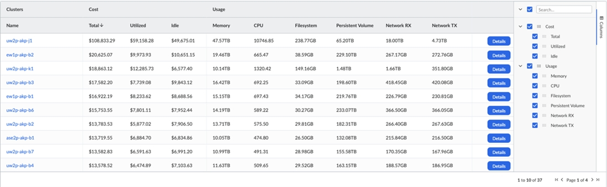

Nota:

- Quaisquer recursos (volumes ou nós) que custem menos do que $0.01/hr não serão refletidos nos custos totais do cluster.
- painel de detalhes permanece inalterado, exceto pelo acréscimo de insights relacionados à recém-introduzida dimensão Persistent Volume.

## Suporte do RI Portfolio and Planner para Azure Cosmos DB - 22 de junho de 2023

Esta versão amplia o suporte dos serviços Azure para incluir o Azure Cosmos DB no RI Portfolio and Planner. O RI Planner fornece aos clientes do Cloudability recomendações para instâncias do Azure Cosmos DB.

Como esse recurso pode ajudá-lo

Os clientes podem visualizar a economia e os benefícios da compra proposta de RI e filtrar as recomendações com base no período de análise, região, escopo, termos e contas. O portfólio de reservas fornecerá aos clientes do Cloudability seu portfólio de reservas atual para instâncias do Azure Cosmos DB, juntamente com os outros serviços para os quais fornecemos suporte atualmente.

Cloudability expande os serviços que o Portfólio de reservas e o Planejador de instâncias reservadas suportam no Azure Cloud em resposta ao crescente número de clientes que utilizam o Azure. Ao incorporar o Azure Cosmos DB, o Cloudability oferece a esses clientes um valor adicional em termos de percepção do valor da compra de reservas no Azure Cloud. Além disso, a adição do suporte Azure Cosmos DB oferece aos clientes percepções e recomendações acionáveis que melhoram seus resultados comerciais, tudo em um único painel.

Mais informações sobre o lançamento

Como parte dessa versão, o recurso Planejador/Recomendação agora estará localizado no item de menu Otimizar > Planejador de Instância Reservada, enquanto o recurso Portfólio continuará localizado no item de menu Insights > Portfólio de Reserva.

Nota:

Caso ainda não tenham sido concluídos, os clientes precisam garantir que as credenciais e permissões necessárias do site Azure tenham sido ativadas para fornecer ao Cloudability acesso aos seus dados.

## Suporte para as versões Kubernetes 1.26 e 1.27 - 15 de junho de 2023

Com esta versão, a alocação de custos de contêineres é oficialmente compatível com a versão Kubernetes 1.26 para todos os provedores e a versão 1.27 no Amazon Elastic Kubernetes Service (EKS).

Como esse recurso pode ajudá-lo

Esse recurso permitirá que os clientes tenham visibilidade do uso de recursos de contêineres e do custo de seus clusters executados em ambas as versões do Kubernetes.

Agora, os clientes devem poder fazer download e implementar nosso agente de métricas usando o fluxo de trabalho de provisionamento regular.

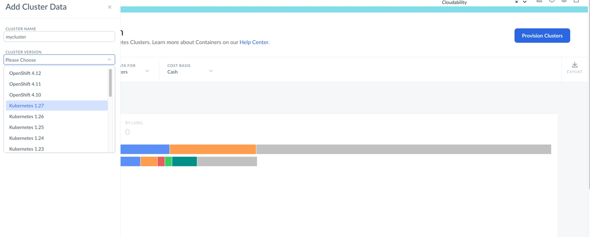

Nota:

Nosso agente de métricas ainda não foi testado com o Azure Kubernetes Service ( AKS ) e o Google Kubernetes Engine ( GKE ) para a versão 1.27. Assim que Azure e GCP anunciarem oficialmente o suporte à versão 1.27, validaremos nosso agente de métricas e atualizaremos nossas notas de lançamento.

## Suporte para clusters Red Hat OpenShift em AWS ( ROSA ) - 7 de junho de 2023

Esta versão introduz o suporte para clusters Red Hat OpenShift em AWS ( ROSA ).

Ao incorporar o ROSA ao ecossistema do Cloudability, os usuários agora podem acompanhar e alocar com eficácia os custos associados aos seus clusters do OpenShift, alinhando-os aos recursos já disponíveis para usuários do EKS, GKE e AKS.

Isso permitirá que os clientes do Cloudability que utilizam o ROSA acessem informações detalhadas de alocação de custos especificamente adaptadas aos seus recursos de contêineres do OpenShift.

Nota:

O suporte para as versões de cluster OpenShift 4.10, 4.11 e 4.12 está incluído nesta versão.

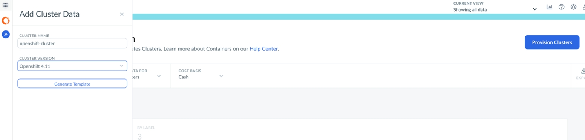

Como esse recurso pode ajudá-lo

Com essa versão, os usuários podem identificar e selecionar facilmente sua versão preferida do cluster OpenShift ao provisionar recursos. Esse aprimoramento proporciona maior flexibilidade aos usuários e permite que eles aproveitem os recursos e melhorias específicos oferecidos pelas diferentes versões do OpenShift.

Mais informações sobre esta versão

Siga estas etapas para visualizar e escolher as versões do cluster OpenShift durante o processo de provisionamento:

1. Acesse a plataforma Cloudability e navegue até a seção Insights.
2. Selecione Container e, em seguida, Provision Cluster. Você notará que, em vez da opção Kubernetes Version, agora há uma opção Cluster Version.
3. Selecione Cluster Version para continuar.
4. No menu suspenso que aparece, você verá não apenas as versões existentes do Kubernetes, mas também as versões disponíveis do OpenShift.
5. Escolha a versão desejada do site OpenShift no menu suspenso.

## Azure Portfólio e recomendações do Plano de Poupança com suporte - 31 de maio de 2023

Esta versão lança o Azure Savings Plan Recommendations & Portfolio for Compute em Cloudability. Isso ajuda os clientes a entender o inventário de seus planos de economia e a receber recomendações de compra para otimizar a economia de custos.

Anteriormente, as recomendações de planos de poupança eram fornecidas apenas para AWS em Cloudability. Azure os planos de economia oferecem uma opção adicional para reduzir os custos dos clientes com gastos consistentes em computação, comprometendo-se com um gasto fixo por hora em serviços de computação por períodos de um ou três anos.

Como esse recurso pode ajudá-lo

Azure agora, os clientes podem visualizar o inventário do Savings Plan e receber recomendações de compra na plataforma Cloudability. Os clientes podem visualizar um inventário de seus Planos de Poupança Azure atuais, juntamente com KPIs resumidos para a quantidade total e o comprometimento por hora de seus Planos de Poupança. Os clientes também podem visualizar as recomendações de compra do Azure Savings Plan, bem como os totais resumidos de KPI para todas as recomendações fornecidas, incluindo o número total de compras recomendadas, o total de taxas iniciais, a economia líquida estimada e a taxa de economia estimada.

Mais informações sobre esta versão

No menu de navegação principal do site Cloudability,

- Em Insights, selecione Planos de poupança e, em seguida, selecione a guia Azure para acessar seu portfólio de planos de poupança.
- Em Optimize (Otimizar ), selecione Reserved Instance Planner (Planejador de instância reservada ) e, em seguida, selecione a guia Azure SP para acessar as recomendações do plano de economia.

Nota:

- Para todos os fornecedores, os portfólios do Plano de Poupança agora estarão no menu Insights e as recomendações do Plano de Poupança estarão no menu Optimize.
- Caso ainda não tenham sido concluídos, os clientes precisam garantir que as credenciais e permissões necessárias do site Azure tenham sido ativadas para fornecer ao site Cloudability acesso aos dados do Plano de Poupança.
- Clientes do MCA: configurem o leitor da conta de cobrança por função, seguindo as instruções [aqui](../admin/azure-cm-ea.html#azure-cm-ea__grant).
- Clientes do EA: Regenerem e executem novamente o script no nível do EA, seguindo as instruções [aqui](../admin/azure-cm-ea.html#azure-cm-ea__Configur).

## Reconhecimento da rescisão de recursos com suporte no ROI do Rightsizing - 31 de maio de 2023

Nesta versão, o encerramento do recurso é reconhecido no cálculo da economia realizada no Rightsizing ROI.

Aplica-se quando a ação apropriada de rightsizing é encerrar um recurso individual. Anteriormente, o ROI do Rightsizing não levava em conta as rescisões de recursos ao calcular ou exibir a economia realizada com essas ações.

Como esse recurso pode ajudá-lo

Essa funcionalidade permite que os usuários do site Cloudability utilizem a funcionalidade Rightsizing ROI para calcular a economia realizada das recomendações acionadas quando a ação é o encerramento do recurso. Depois que uma recomendação de redimensionamento tiver sido adicionada por meio do ROI de redimensionamento e o recurso tiver sido encerrado, a economia realizada com o encerramento será calculada e exibida para o recurso individual e adicionada ao total acumulado de todas as economias realizadas.

Isso é um acréscimo ao suporte já fornecido para os cálculos de economia realizada quando um recurso é dimensionado. Será fornecido suporte para todos os serviços atualmente suportados pelo Rightsizing ROI.

Mais informações sobre esta versão

No menu de navegação principal do site Cloudability,

- No menu Optimize, selecione Rightsizing ROI.
- Sempre que o recurso foi encerrado, um valor de Economia Realizada é exibido na parte inferior da lista de recomendações de ajuste rastreadas.
- Observação: O valor da poupança realizada também será adicionado ao total de poupança realizada exibido na parte superior da página.

## Distribuição de custos ociosos disponível para contêineres em Cloudability core analytics - 19 de maio de 2023

Esta versão apresenta seis novas métricas para que os usuários do site Cloudability possam dividir as dimensões do contêiner de acordo com suas preferências.

É inevitável que a infraestrutura em contêineres execute uma certa quantidade de capacidade de sobrecarga que não é usada pelas cargas de trabalho subjacentes. Esse uso "ocioso" tem um custo associado (para as VMs e os volumes de apoio) que precisa ser contabilizado. Introduzimos a capacidade de distribuir esses custos de contêineres ociosos na análise principal do site Cloudability (relatórios e painéis). Embora esse seja um recurso que já existe no recurso dedicado de alocação de custos de contêineres, adicioná-lo à análise principal pode ajudar os usuários a simplificar os processos de estorno e permite relatórios de custos mais flexíveis. Essa distribuição é feita no contexto das construções Kubernetes namespace e label.

Esse suporte é implementado por meio da introdução de uma nova categoria de métrica "Contêineres", que disponibiliza seis novas métricas. Essas métricas permitem que os usuários visualizem separadamente os custos utilizados, ociosos e de fairshare com base em dinheiro ou amortizada. Para clientes com preços personalizados ativados, todos eles serão representados como métricas "ajustadas".

Como esse recurso pode ajudá-lo

O recurso de alocação de custos de contêineres avalia a utilização de recursos em cada nó e associa isso aos dados de faturamento para calcular o custo de cada cluster e associar um "custo utilizado" direto aos valores de rótulo e espaço de nome K8s (isso está disponível nos relatórios principais usando o espaço de nome ou uma dimensão de rótulo). Com esse aprimoramento, você também pode informar sobre o custo ocioso por meio da nova métrica, que é alocada aos valores de namespace e rótulo proporcionalmente com base na contribuição de custo direto de cada nó. O custo do Fairshare é simplesmente o custo utilizado e o custo ocioso combinados - você poderia pensar nisso como o custo total.

Mais informações sobre esta versão

Algumas considerações e ideias de relatórios para ter em mente com essas novas métricas:

- Para custos que não sejam de contêineres, todas essas novas métricas retornarão como US$ 0. Para filtrar apenas os dados do contêiner, tente um filtro como "Cluster Name not equals (not set)"
- Use essas métricas com diferentes dimensões para visualizar facilmente o que está sendo utilizado e o que está ocioso. Por exemplo, listar por nome do cluster ou ID do recurso.
- Pela primeira vez, você pode usar a base de caixa e a base de custo amortizado em conjunto para obter relatórios detalhados de custos de contêineres.

Com essa versão, as novas métricas introduzidas refletirão os dados de custo a partir de 1º de maio de 2023. Para atualizar dados históricos adicionais, entre em contato com a equipe da sua conta ou com o suporte para que o reprocessamento seja concluído.

## Prompt ao renderizar 500 ou mais pontos de dados em gráficos Cloudability - May 18, 2023

Esta versão adiciona um recurso de aviso em Cloudability quando os usuários tentam renderizar 500 ou mais pontos de dados em gráficos Cloudability.

Anteriormente, os usuários do Cloudability enfrentavam problemas de desempenho da página quando tentavam renderizar 500 ou mais pontos de dados em suas visualizações de gráficos. Indiscutivelmente, 500 ou mais pontos de dados em um único gráfico não atendem à sua finalidade devido à baixa legibilidade, e a renderização dos mesmos muitas vezes tornava a página inteira dos Dashboards mais lenta para nossos usuários.

Como esse recurso pode ajudá-lo

Cloudability agora exibirá um aviso quando os usuários tentarem renderizar 500 ou mais pontos de dados em seus gráficos, o que evitará problemas de desempenho da página. No momento da criação do gráfico, os usuários podem não estar cientes de que estão tentando renderizar a visualização de uma medida de alta cardinalidade, como o ID do recurso, mas um prompt como esse os ajudaria a sinalizar os possíveis riscos futuros caso decidam prosseguir com a ação. Esse aviso será exibido em todos os gráficos em que o limite for excedido e sempre que a página Dashboards for carregada em Cloudability.

Mais informações sobre esta versão

O prompt terá duas CTAs:

- Edit Query (Editar consulta) - Permite voltar à janela de edição e reduzir os pontos de dados (para menos de 500).
- Graph Anyway - Os usuários podem continuar a renderizar com o número escolhido de pontos de dados.

## Suporte à utilização de GPU para AWS Rightsizing ASG - 11 de maio de 2023

Esta versão dá continuidade ao aprimoramento correlacionado à GPU das recomendações de dimensionamento de direitos do site Cloudability, incorporando e utilizando o processamento da GPU e a utilização da memória.

Antes desta versão, os dados da GPU não eram considerados ao recomendar o rightsizing do grupo de dimensionamento automático do AWS. Com esta versão, os clientes do AWS que utilizam grupos de autoescalonamento e cujos dados são importados pelo Apptio por meio do CloudWatch ou do Datadog agora poderão incluir seus dados de GPU para receber recomendações aprimoradas de ajuste de capacidade que levem esses dados em consideração.

Como esse recurso pode ajudá-lo

AWS os clientes que usam grupos de dimensionamento automático com GPUs agora receberão recomendações de economia com base nas métricas de GPU ingeridas pelo site Apptio. Além de proporcionar economias adicionais para nossos clientes, essas métricas fornecem uma nova dimensão para nosso mecanismo de recomendação.

Mais informações sobre esta versão

1. No menu de navegação principal do site Cloudability, selecione Optimize > Rightsizing (Otimizar > Redimensionamento )
2. Selecione a guia AWS e, em seguida, selecione AWS ASG.   
    As recomendações de redimensionamento para grupos de dimensionamento automático com GPUs serão exibidas automaticamente quando estiverem configuradas e disponíveis corretamente. A visualização “detalhes” da recomendação para grupos de autoescalonamento que utilizam GPUs passará a incluir gráficos adicionais sobre a utilização da GPU (%) e da memória da GPU, assim como nas recomendações de ajuste de capacidade do AWS EC2.

   Não é necessária nenhuma configuração adicional para os clientes que já tenham as recomendações de ajuste de capacidade do AWS Auto Scaling Group e a captação de dados de utilização de GPU configuradas com o Cloudability.

## Valores “máximos” adicionados à API do Rightsizing e à exportação do CSV - 18 de abril de 2023

Esta versão anuncia o lançamento dos valores “Throughput Max” e “IOPS Max” tanto para os endpoints da API do Rightsizing quanto para as exportações do Rightsizing CSV para cada serviço de disco do fornecedor correspondente que é compatível com o Rightsizing.

Mais informações sobre esta versão

Os valores no ponto de extremidade da API são designados como “iopsMax” e “throughputMax”. Os valores no arquivo “ CSV ” exportado conterão os nomes de coluna “IOPS Max” e “Throughput Max”.

## Lançamento do Cloudability GCP Recomendações sobre descontos por uso comprometido - 6 de abril de 2023

Este comunicado anuncia o lançamento das recomendações do Desconto por Uso Comprometido (CUD) d GCP para os clientes.

Cloudability agora oferece recomendações para CUDs do tipo “ GCP ” utilizando seu próprio mecanismo personalizado e uma nova interface de análise. Com essa nova interface, os clientes podem realizar análises hipotéticas e ter mais controle sobre a recomendação gerada, o que lhes permite ajustar as recomendações com base no uso futuro, na estratégia de negócios e no fator de risco.

Como esse recurso pode ajudá-lo

Em primeiro lugar, os clientes podem filtrar seu uso para análise, o que lhes permite incluir ou excluir o uso para obter uma análise mais precisa que represente seu uso futuro. Se uma carga de trabalho estava em execução durante o período de análise, mas não deveria ser coberta, como uma carga de trabalho de teste ou desenvolvimento, ela pode ser removida da análise. Além disso, se uma carga de trabalho estiver sendo desativada ou se você for substituir um tipo específico de uso, como um sistema operacional ou um software de banco de dados, poderá excluir esse uso da análise. Dessa forma, sua estratégia de negócios será alinhada com recomendações mais precisas para uso futuro.

Os clientes podem adicionar até 10 dimensões do Cloudability à sua análise para filtragem. Essas dimensões podem ser qualquer uma das Tags & Labels, Account Groups ou Business Mappings configurados.

Em segundo lugar, os clientes podem visualizar o uso selecionado para análise e ajustar as recomendações em tempo real. Isso permitirá que eles visualizem os possíveis resultados com base em diferentes valores de compromisso. Isso ajuda os clientes a visualizar o impacto de níveis mais baixos de compromisso em caso de tendência de redução do uso ou de períodos sustentados de menor uso.

## Suporte para APIs de gerenciamento de custos Azure - 30 de março de 2023

Esta versão traz o suporte para as APIs de gerenciamento de custos do Azure em Cloudability Credentials. Azure Os clientes da EA agora podem usar essas APIs para obter o custo real e o custo amortizado usando as APIs de gerenciamento de custos.

As APIs de relatórios existentes do Azure não têm mais suporte da Microsoft e serão descontinuadas até outubro de 2023. A API de gerenciamento de custos é uma alternativa para a recuperação de dados de faturamento, em vez das exportações de contas de armazenamento.

Etapas para a credencial Azure usando as novas APIs de gerenciamento de custos:

Etapas para um novo cliente:

1. Acesse a página de credenciamento Cloudability e selecione Azure.
2. Selecione EA como o tipo de conta Azure.
3. Digite a ID de registro Azure e a ID de assinatura.
4. Digite NA em todos os outros campos.
5. Selecione Generate Setup Script (Gerar script de instalação ) e instale o script PowerShell. Esse script do power shell terá uma nova função chamada de leitor de registro, que é usada para acessar a API de gerenciamento de custos.
6. Depois de concluir, verifique as credenciais na interface do usuário do Cloudability. 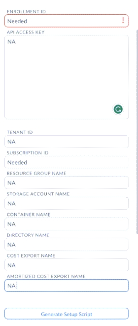

Etapas para clientes EA existentes com APIs de relatórios:

1. Se o acesso à função de leitor de registro já estiver disponível, insira NA em API Access Key e verifique as credenciais.
2. Se o acesso à função de leitor de registro não estiver disponível, siga as etapas como para um novo cliente.

Etapas para clientes EA existentes com armazenamento Blob:

Nada precisa ser feito. No caso de exportações de faturamento via blob, o site Cloudability continuará a buscar os arquivos de faturamento a partir daí.

## Permitir recomendações de redução de memória/GPU sem métricas - 29 de março de 2023

Esta versão adiciona duas novas configurações globais nas Preferências de Rightsizing. Os clientes podem ativar recomendações de redução de memória sem métricas de utilização de memória e recomendações de redução de GPU sem métricas de utilização de GPU.

Configurações de recomendação de memória/GPU em Preferências de redimensionamento

Cloudability os usuários com configurações globais podem ativar/desativar recomendações que resultariam em uma redução na capacidade de componentes específicos (memória e GPU), mesmo que as métricas desses componentes não estejam disponíveis em Cloudability.

Para cada uma dessas configurações, se a configuração estiver ativada, o cliente receberá recomendações que poderiam proporcionar uma economia extra com a redução da capacidade do componente, mas sem levar em consideração as métricas atuais do componente se as métricas não estiverem disponíveis em Cloudability.

Para cada uma dessas configurações, se a configuração estiver desativada e as métricas do componente não estiverem disponíveis em Cloudability, as recomendações serão limitadas à capacidade equivalente ou superior (com a configuração de GPU aplicando-se somente a instâncias baseadas em GPU e utilizando a família de instâncias).

Ambas as configurações estão desativadas por padrão.

Como esse recurso pode ajudá-lo

Essas recomendações ajudam os clientes a economizar dinheiro reduzindo a capacidade de determinados componentes, mesmo que essas recomendações não considerem as métricas atuais desses componentes. Por exemplo, a familiaridade de um cliente com o recurso permitiria que ele soubesse que a redução da capacidade do componente não afetaria a carga de trabalho.

Mais informações sobre esta versão

1. No menu de navegação principal do site Cloudability, selecione Settings > Rightsizing Preferences.
2. Em Preferências de Computação ( VM ), selecione a seção Redução de Capacidade.
3. Na seção Redução de capacidade, consulte Permitir recomendações de redução de memória sem métricas de utilização de memória e Permitir recomendações de redução de GPU sem métricas de utilização de GPU. Essas opções estão desmarcadas por padrão.

## Azure Atualização da interface do usuário das credenciais de função personalizada - 15 de março de 2023

Esta versão apresenta as permissões de função personalizadas do Azure na interface do usuário de credenciais do Cloudability de uma maneira fácil de usar. Os clientes poderão ver se têm a função personalizada Azure ativada ou não nos detalhes das credenciais. Pode haver alguns cenários de funções que estão descritos abaixo.

1. Cloudability Os clientes com a função de leitor “ Azure ” e sem função personalizada continuarão a ver a função de leitor “ Azure ” representada por uma marca de seleção verde (  ), e as permissões personalizadas não serão exibidas.

   1. Administração: Leitor 
   2. Inscrição: ReadSubscription 

   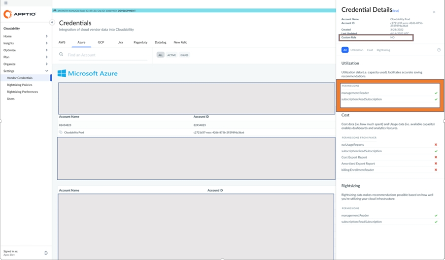
2. Cloudability Os clientes com a função Personalizada ativada verão apenas as permissões personalizadas e não verão a função de leitor Azure.

   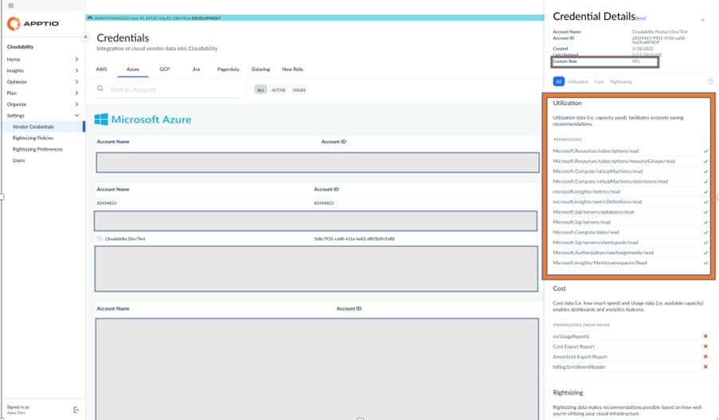

Nota:

- Para ter apenas a função personalizada Azure, os clientes devem remover a função de leitor Azure e, em seguida, ativar a função personalizada.
- Isso é aplicável às contas de assinatura e não à conta de faturamento.

## Separação das tags do grupo de recursos Azure - 2 de março de 2023

Esta versão adiciona o recurso para que o site Cloudability diferencie as tags Azure Resource Group das tags Azure Resource para que os clientes possam identificá-las e gerenciá-las de forma distinta.

Separação de tags de nível de recurso e tags de grupo de recursos

Anteriormente, o site Cloudability não fazia distinção entre uma tag de Grupo de Recursos e uma tag de Recurso, ambas eram mescladas e tratadas como tags de Recurso. Os clientes agora podem rastrear e gerenciar melhor seus grupos de recursos criando uma nova dimensão comercial para eles, aplicando regras específicas/mapeamentos comerciais a eles etc.

Cloudability agora alterará o formato das tags da seguinte forma:

"cldy:Azure:ResourceGroupTag:<TagKey>" para tags geradas no nível do Grupo de Recursos

"cldy:Azure:ResourceTag:<TagKey>" para tags geradas a partir do nível Resource

Esse recurso não é compatível com versões anteriores. As tags do Resource Group que foram descobertas e tratadas como tags do Resource em Cloudability antes desta versão permanecerão como estão.

## Alocação de custos de contêineres - Ponderação aprimorada de CPU/memória para alocação de namespace e rótulo - 1º de março de 2023

Esta versão aprimora a forma como os custos são alocados a Namespaces e Rótulos individuais, correspondendo melhor à forma como as máquinas virtuais subjacentes são cobradas pelos fornecedores de nuvem.

Aprimoramentos na alocação de custos de contêineres

Com esta versão, o site Cloudability aprimorou a forma como os custos são alocados aos valores individuais de Namespace e Label para corresponder melhor à forma como as máquinas virtuais subjacentes são cobradas pelos fornecedores de nuvem. O processo de divisão e alocação do custo de cada VM envolve a distribuição do custo total entre os recursos que o compõem (CPU, memória, rede etc.) e, em seguida, atribuindo o custo a cada Namespace e Label com base na quantidade desses recursos que eles consumiram. A memória e a CPU, juntas, representam a maior parte (85%) dos custos de um VM.

Até agora, o Cloudability utilizava uma proporção padrão para dividir esse componente, independentemente do tipo d VM o (o que fazia com que os custos fossem direcionados para a memória). Com esta versão, o Cloudability passou a definir a proporção de acordo com o tipo de máquina — as máquinas otimizadas para computação terão uma proporção mais voltada para a CPU em comparação com as máquinas otimizadas para memória. Isso foi alcançado através da definição de preços para a CPU (horas-núcleo) e a memória (horas-GB), com base na análise de diferentes categorias do VM e na forma como esses dois tipos de recursos afetam os preços do VM. O resultado líquido é uma representação mais precisa de como cada Namespace e rótulo está contribuindo para os custos.

Mais informações sobre esta versão

Essa versão não afeta a alocação de custos em nível de cluster. Para obter mais informações, participe da conversa na [Comunidade Apptio](https://community.apptio.com/home "(Abre em uma nova guia ou janela)").

## Alocação de custos de contêineres - Exibir somente etiquetas mapeadas Kubernetes - 26 de janeiro de 2023

Esta versão inclui aprimoramentos para exibir apenas rótulos Kubernetes mapeados na página Container Cost Allocation (Alocação de custos de contêineres ).

Aprimoramentos para exibir apenas rótulos mapeados do site Kubernetes

Para melhorar a usabilidade e o desempenho, a página Container Cost Allocation agora exibirá apenas as chaves de etiqueta que foram explicitamente mapeadas na página Tag & Label Mapping (Mapeamento de etiquetas e rótulos ). A página Alocação de custos de contêineres não exibirá mais todos os rótulos históricos.

Se as chaves do rótulo Kubernetes já estiverem mapeadas em seu ambiente Cloudability, não será necessário fazer nenhuma alteração. Para adicionar mais etiquetas Kubernetes, você pode pedir ao administrador do Cloudability para mapear as chaves de etiquetas específicas na página Tags & Mapping. Observe que, se as chaves de rótulo do Kubernetes não estiverem mapeadas em seu ambiente, o menu suspenso Label Key não listará nenhuma chave.

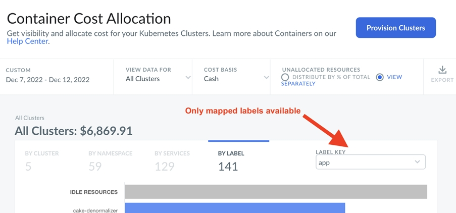

Embora as chaves de rótulo apareçam na página Alocação de custos de contêineres imediatamente após o mapeamento, levará de 24 a 48 horas para que os valores sejam preenchidos. Não há impacto sobre Namespaces, Serviços ou visibilidade de construções Kubernetes no painel Cloudability e nos relatórios associados a esta versão.

## Aprimoramentos de unidade de medida para métricas de transferência de dados, horas de GB e meses de GB - 18 de janeiro de 2023

Esta versão inclui alterações para padronizar a unidade de medida para métricas de uso em Cloudability.

Unidade de medida padronizada para métricas de uso

As métricas de uso agora serão exibidas em gibibytes ( GiB ) em vez de gigabytes (GB) em Cloudability, o que eliminará a confusão e facilitará a compreensão dos dados sem a necessidade de lidar com várias unidades.

A padronização da unidade de medida afeta as seguintes métricas.

| Valor atual | Novo Valor |
| --- | --- |
| Transferência de dados (gb) | Transferência de dados ( GiB ) |
| Horas GB | Horas de GiB |
| GB Meses | Meses de GiB |

Efeitos sobre o redimensionamento

Na página Rightsizing (Redimensionamento ), todas as medidas serão exibidas em GiB e os rótulos mostrarão GiB. Observe que as métricas a seguir já estão representadas em GiB:

RDS tamanho da memória

GCP calcular o tamanho da memória

Azure Tamanho da memória SQL

S3 tamanho da caçamba

## Suporte para Kubernetes 1.25 - Alocação de custos de contêineres - 17 de janeiro de 2023

Esta versão permite que o agente Container Metrics seja executado e colete informações de uso de clusters em execução no Kubernetes 1.25 no ambiente Azure Kubernetes Service ( AKS ).

Suporte para alocação de custos de contêineres no Kubernetes 1.25 em AKS

Cloudability Agora oferece suporte à Alocação de Custos de Contêineres no Kubernetes 1.25 em ambientes AKS. Esse recurso permitirá que você obtenha visibilidade sobre o uso de recursos dos contêineres e o custo dos clusters em execução no Kubernetes 1.25.

Você pode fazer download e implementar o agente do Container Metrics usando o fluxo de trabalho de provisionamento regular. Você pode selecionar Kubernetes 1.25 no seletor Kubernetes Version na página Add Cluster Data (Adicionar dados de cluster ).

O agente Container Metrics não foi testado com clusters que executam o Kubernetes 1.25 nos ambientes Amazon Elastic Kubernetes Service (EKS) e Google Kubernetes Engine ( GKE ). Isso será feito depois que AWS e GCP anunciarem oficialmente o suporte a Kubernetes 1.25.

## Aprimoramentos de uso da família - 17 de janeiro de 2023

Essa versão inclui aprimoramentos na dimensão Usage Family em Cloudability para oferecer melhor qualidade de mapeamento e maior cobertura para itens de linha de custo.

Aprimoramentos na dimensão Família de uso

Fizemos aprimoramentos na dimensão Usage Family. Essas alterações serão refletidas em seus itens de linha de custo a partir de 1º de janeiro de 2023. Se for necessário refletir essas alterações além da data padrão, entre em contato com a equipe da sua conta ou com o suporte para reprocessar os dados.

Os aprimoramentos oferecem os seguintes benefícios.

Maior cobertura para itens de linha de custo

A cobertura é definida como a porcentagem do custo classificado em relação ao total. Quase 99% do custo agora será classificado nos valores apropriados da Família de Uso, reduzindo assim o custo não mapeado (ou seja, Outros ).

Melhoria da qualidade do mapeamento

Para oferecer uma atribuição aprimorada de itens de linha de custo, alguns valores de Família de uso existentes foram remapeados.

O exemplo a seguir apresenta uma visão geral dos valores remapeados.

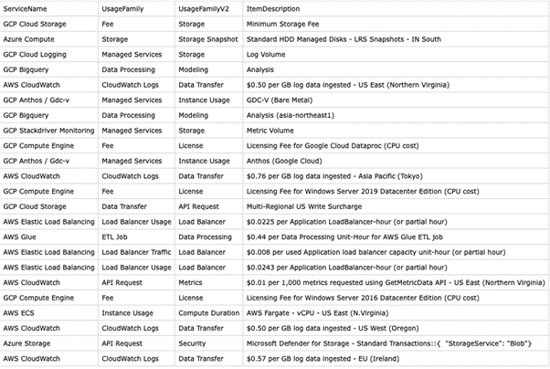

Novo uso Valores familiares

Esta versão apresenta dois valores da Família de Uso:.

Segurança: Os exemplos são apresentados a seguir:

AWS amazon GuardDuty, EUW2-PaidKubernetesAuditLogsAnalyzed, $ per Month for Policy-WAF, Amazon Inspector UGE1-agent-assessments, Security Checks for PaidComplianceCheck, $ per endpoint hour for AWS Network Firewall

Azure : Proteção Avançada contra Ameaças: Azure Database for PostgreSQL/SQL, Azure Defender::Microsoft Defender for Containers, Microsoft Defender for IoT - Managed Devices - Standard

GCP : Clusters com autorização binária ativada, Cloud IDS

Balanceador de carga: O uso do balanceador de carga anterior era muito granular. Esse valor agora inclui algumas alterações.
